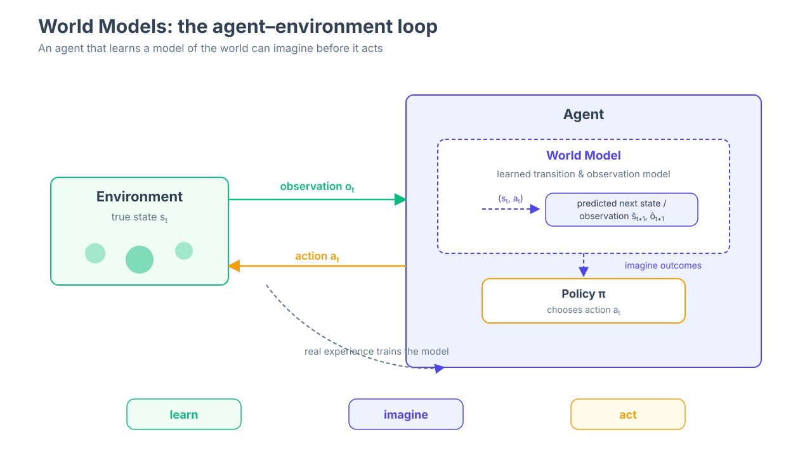

# World Models & Spatial Intelligence

**From Representation to Prediction, Planning and Physical Intelligence**

> 🏫 **CUHK(SZ) · SAI · BL&SP Research Group** — 香港中文大学（深圳）人工智能学院 BL&SP 课题组

一门开源课程：从世界表征（Representation）到预测（Prediction）、规划（Planning）与物理智能（Physical Intelligence）。

**中文版**（本页） | [English Version](README_EN.md)

> 📖 **课程网站（主入口）**：https://overdued.github.io/world-model-spatial-intelligence-course/
>
> 本仓库是课程的内容源。学习请从网站开始，不需要理解仓库目录结构。



## 这是什么

"World Model" 正在成为连接表示学习、生成模型、强化学习与机器人学的核心概念；"Spatial Intelligence" 是它落地物理世界的关键能力。但目前没有任何一门公开课完整覆盖这条链路。本课程把全球 11 门顶尖高校课程（UPenn、Stanford、CMU、MIT、ETH/UZH、UCSD、Berkeley、Cornell、TUM、Columbia、Harvard）的公开材料重新组织为**两条可立即开始的学习路线**，配交互式 roadmap、统一模块模板和可运行的 Colab 实验。

## Roadmap

```
Observation → World State → Representation → Dynamics → Prediction → Planning → Action
```

交互式完整路线图（节点可点击进模块）：[课程网站 Roadmap](https://overdued.github.io/world-model-spatial-intelligence-course/roadmap)

## Learning Tracks

| Track | 路线 | 适合 |
|---|---|---|
| 🧩 **Foundations** | 数学 / PyTorch / CV / RL 地基，按需回查 | 所有人 |
| 🧑‍🔬 **World Model Scientist** | POMDP → SSM → RSSM → Dreamer → Planning → Video WM → Evaluation | 想造世界模型的研究者 |
| 👷 **Spatial & Embodied Engineer** | Geometry → Depth/Point Cloud → NeRF/3DGS → SLAM/VIO → Navigation → VLA | 想造空间智能系统的工程师 |

每个模块统一模板：Why this matters → Visual Intuition → Core Idea → Key Concepts → Core Equations → University Lecture（溯源到具体大学 lecture）→ Papers（Must Read / Recommended / Optional）→ Hands-on → Check Your Understanding → Takeaway → Next Module。

## Labs

11 个全部可运行（CPU 即可，Colab 免费层一键执行）：

| Lab | 内容 | Runtime |
|---|---|---|
| [Lab 0 · Tiny World](labs/lab00_tiny_world/) | 从零构建环境：state/obs/action/transition/reward | CPU ~5s |
| [Lab 1 · Kalman Filter](labs/lab01_kalman_filter/) | 手写 KF predict/update + 不确定性可视化 | CPU ~3s |
| [Lab 2 · Latent Dynamics](labs/lab02_latent_dynamics/) | image→encoder→dynamics→decoder，rollout 与误差累积 | CPU ~1min |
| [Lab 3 · Tiny RSSM](labs/lab03_tiny_rssm/) | deterministic h + stochastic z，prior/posterior/KL，imagination rollout | CPU ~3min |
| [Lab 4 · MPC / CEM Planning](labs/lab04_mpc_cem_planning/) | 用学到的模型做规划：候选轨迹、receding horizon | CPU ~15s |
| [Lab 5 · NeRF / 3DGS](labs/lab05_nerf_gaussian_splatting/) | 手写 tiny NeRF：rays→sampling→volume rendering→novel view | CPU ~3.5min |
| [Lab 6 · Dynamic 4D Worlds](labs/lab06_dynamic_4d_worlds/) | (x,y,z,t)：ICP 运动估计、时间插值、未来预测 | CPU ~10s |
| [Lab 7 · Video World Model](labs/lab07_video_world_model/) | ConvGRU 视频预测，1/5/10 步退化 | CPU ~2min |
| [Lab 8 · Navigation World Model](labs/lab08_navigation_world_model/) | 部分可观测导航：Reactive vs Memory vs World-Model | CPU ~30s |
| [Lab 9 · World Model + Policy](labs/lab09_world_model_policy/) | Tiny Dreamer：imagination 中训练 actor-critic | CPU ~45s |
| [Lab 10 · OOD / Drift Evaluation](labs/lab10_ood_drift_evaluation/) | ID/Mild/Strong OOD + Failure Gallery | CPU ~2.5min |

每个 Lab 的 README 都有 **Open in Colab** 徽章。Lab 0–2 的 notebook 为英文；Lab 3–10 另附英文版 notebook（`notebook_en.ipynb`），英文站点会自动链接到英文版。状态统一由 [`labs/manifest.json`](labs/manifest.json) 维护。最终项目见 [capstone/](capstone/)（Build Your Own World Model）。

## University Sources

课程模块中每个知识点都溯源到大学 lecture。完整调研（11 门课程的索引、对比、公开度、链接状态）：

- [COURSE_INDEX.md](COURSE_INDEX.md) · [COURSE_COMPARISON.md](COURSE_COMPARISON.md) · [MATERIAL_STATUS.md](MATERIAL_STATUS.md) · [LICENSES.md](LICENSES.md)
- 逐课资料：`courses/<course_id>/`（UPenn CIS 6280、Stanford CS231A、CMU 16-825、MIT VNAV、ETH/UZH VAMR、UCSD、Berkeley、Cornell、TUM、Columbia、Harvard）
- 课程体系与主题分析：`synthesis/`

> 受版权/许可限制，课程 PDF 不上传本仓库，仅保留本地研究副本；原始官方链接逐条记录在 `courses/<course_id>/links.md`。

## Repository Structure

```
├── website/      ← Docusaurus 课程网站（主入口，GitHub Pages 自动部署）
├── labs/         ← 可运行实验（Colab 兼容）
├── courses/      ← 研究档案：11 门大学课程资料索引与本地材料
├── synthesis/    ← 研究档案：课程体系分析与课程设计 V0.1
├── metadata/     ← 研究档案：courses.json / courses.csv（脚本自动生成）
└── scripts/      ← 下载 / 链接检查 / 元数据 / 索引维护脚本
```

## 延伸资源

**参考实现**（完成对应 Lab 后的下一步）

- Lab 2 → [lucas-maes/le-wm](https://github.com/lucas-maes/le-wm)（LeWorldModel：单卡即可从像素训练的 JEPA 世界模型）
- Lab 3 / Lab 9 → [danijar/dreamerv3](https://github.com/danijar/dreamerv3)（DreamerV3 官方实现）
- Lab 4 → [nicklashansen/tdmpc2](https://github.com/nicklashansen/tdmpc2)（TD-MPC2）· [gaoyuezhou/dino_wm](https://github.com/gaoyuezhou/dino_wm)（DINO-WM）
- Lab 5 → [nerfstudio-project/nerfstudio](https://github.com/nerfstudio-project/nerfstudio) · [nerfstudio-project/gsplat](https://github.com/nerfstudio-project/gsplat)
- Lab 7 → [simchowitzlabpublic/nano-world-model](https://github.com/simchowitzlabpublic/nano-world-model)（极简视频世界模型）· [eloialonso/diamond](https://github.com/eloialonso/diamond)（扩散世界模型）
- Lab 8 → [facebookresearch/habitat-lab](https://github.com/facebookresearch/habitat-lab)（具身导航仿真）

**博客与文章**

*世界模型入门*
- [World Models 交互式论文](https://worldmodels.github.io/)（Ha & Schmidhuber, 2018）
- [World Models](https://rohitbandaru.github.io/blog/World-Models/)（Rohit Bandaru）
- ['World Models,' an Old Idea in AI, Mount a Comeback](https://www.quantamagazine.org/world-models-an-old-idea-in-ai-mount-a-comeback-20250902/)（Quanta Magazine, 2025）
- [The Dream Machines: Learning to Simulate and Act in the Physical World](https://richardcsuwandi.github.io/blog/2025/dream-machines/)（Richard Cornelius Suwandi, 2025）
- [Beyond the Hype: How I See World Models Evolving in 2025](https://knightnemo.github.io/blog/posts/wm_2025/)（Nemo）
- [A Path Towards Autonomous Machine Intelligence](https://openreview.net/forum?id=BZ5a1r-kVsf)（Yann LeCun，JEPA 立场论文）

*JEPA 与隐空间世界模型*
- [Deep Dive into Yann LeCun's JEPA](https://rohitbandaru.github.io/blog/JEPA-Deep-Dive/)（Rohit Bandaru）
- [SIGReg from First Principles: A Step-by-Step Construction of an Anti-Collapse Regularizer for JEPAs](https://rezabyt.github.io/blogposts/sigreg-tutorial.html)（Reza Bayat, 2026）

*视频与交互式世界模型*
- [Towards Video World Models](https://www.xunhuang.me/blogs/world_model.html)（Xun Huang）
- [Diffusion Models for Video Generation](https://lilianweng.github.io/posts/2024-04-12-diffusion-video/)（Lilian Weng, 2024）
- [Genie 2: A Large-Scale Foundation World Model](https://deepmind.google/discover/blog/genie-2-a-large-scale-foundation-world-model/)（Google DeepMind）
- [Genie 3: A New Frontier for World Models](https://deepmind.google/discover/blog/genie-3-a-new-frontier-for-world-models/)（Google DeepMind）

*基于模型的强化学习与智能体*
- [DreamerV3 项目页](https://danijar.com/project/dreamerv3/)（Hafner et al.）
- [Model-Based Reinforcement Learning: Theory and Practice](https://bair.berkeley.edu/blog/2019/12/12/mbpo/)（Michael Janner, BAIR Blog, 2019）
- [Do Agents Need a World Model?](https://richardcsuwandi.github.io/blog/2025/agents-world-models/)（Richard Cornelius Suwandi, 2025）

*机制性世界模型与科学发现*
- [World Models for Scientific Discovery](https://richardcsuwandi.github.io/blog/2026/wm-discovery/)（Richard Cornelius Suwandi, 2026）

*空间智能与 3D*
- [From Words to Worlds: Spatial Intelligence is AI's Next Frontier](https://drfeifei.substack.com/p/from-words-to-worlds-spatial-intelligence)（Fei-Fei Li）
- [Marble: A Multimodal World Model](https://www.worldlabs.ai/blog/marble-world-model)（World Labs）
- [NeRF Tutorial, ECCV 2022](https://sites.google.com/berkeley.edu/nerf-tutorial/home)
- [Introduction to 3D Gaussian Splatting](https://huggingface.co/blog/gaussian-splatting)（Hugging Face）
- [Road to 3D Gaussian Splatting](https://nazirnayal.xyz/blog/2024/road-to-3dgs/)（Nazir Nayal, 2024）

**相关 Awesome 列表**

- [knightnemo/Awesome-World-Models](https://github.com/knightnemo/Awesome-World-Models)：世界模型论文总表
- [leofan90/Awesome-World-Models](https://github.com/leofan90/Awesome-World-Models)：具身智能与自动驾驶中的世界模型
- [mll-lab-nu/Awesome-Spatial-Intelligence-in-VLM](https://github.com/mll-lab-nu/Awesome-Spatial-Intelligence-in-VLM)：VLM 空间推理
- [opendilab/awesome-model-based-RL](https://github.com/opendilab/awesome-model-based-RL)：基于模型的强化学习
- [MrNeRF/awesome-3D-gaussian-splatting](https://github.com/MrNeRF/awesome-3D-gaussian-splatting)：3D Gaussian Splatting

完整可筛选论文列表（含综述与机制性世界模型论文）见课程网站 [Papers](https://overdued.github.io/world-model-spatial-intelligence-course/docs/resources/papers)。

## Citation

```bibtex
@misc{wmsi-course,
  title  = {World Models \& Spatial Intelligence: An Open Course},
  author = {overdued},
  year   = {2026},
  url    = {https://github.com/overdued/world-model-spatial-intelligence-course}
}
```

## License

- 课程内容（website/docs、synthesis）：**CC BY 4.0**，见 [LICENSE-CONTENT](LICENSE-CONTENT)
- 代码（labs、scripts、website/src）：**MIT**，见 [LICENSE](LICENSE)
- 第三方大学课程材料：版权归原作者/高校所有（见 [LICENSES.md](LICENSES.md)），本仓库仅索引链接、不再分发

## Acknowledgements

所有被收录课程的教师与助教团队；模板灵感来自 [mlabonne/llm-course](https://github.com/mlabonne/llm-course)（Apache-2.0）。
