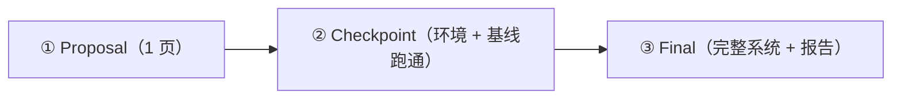

# Build Your Own World Model

> 课程毕业项目（Capstone）：把 Lab 0–10 的全部技能组装成一个完整的世界模型系统。
> 适用对象：Scientist Track 与 Spatial Track 的共同毕业项目。

---

## 1. 项目定位与目标

Lab 0–10 中，每个 Lab 的接口都是别人定义好的：environment 是现成的、state 是给定的、evaluation 的指标已经写好。Capstone 要求你完成一次**完整的研究演练**——自己定义接口，并把课程中的组件组装成一个端到端系统：

```
observation → latent/world state → transition model → prediction → planning/policy → evaluation（含 OOD）
```

**硬性约束**（沿用 UPenn CIS 6280 Final Project 的表述）：你必须在一个应用领域探索一种世界建模方法，并**显式声明** modeled state、transition、action interface 与 evaluation criteria。模糊的"我训了个视频预测模型"不合格；"state 是 128 维 RSSM 潜状态、transition 是 action 条件的 GRU + Gaussian head、action 是 2 维连续力、评估用 ID/OOD 对比协议"才合格。

**目标不是模型多强，而是：**

1. 接口定义有多清楚（十问能否逐一回答）；
2. 评估有多严谨（统计声明而非"看起来 work"）；
3. 失效分析有多诚实（failure cases 与 OOD 行为）。

算力预算：所有方向都有 Colab 免费 T4 可完成的档位——缩小分辨率/状态维度/数据量，把精力放在接口定义与评估严谨性上，那才是评分点。

---

## 2. 六个可选方向

每个方向给出：一句话描述、建议的最小可行范围（MVP）、可复用的 Lab 组件、难度（★ 最低，★★★ 最高）。

### 2.1 Navigation（导航世界模型）

- **描述**：为导航智能体构建世界模型，在 imagination 中规划到达目标。
- **MVP**：2D grid 或 Lab 8 的导航环境 + latent dynamics + MPC/CEM 规划，报告 success rate 与规划 horizon 的关系。
- **可复用组件**：Lab 0（environment 接口）、Lab 2/3（latent dynamics / RSSM）、Lab 4（MPC/CEM）、Lab 8（navigation world model）、Lab 10（OOD 评估）。
- **难度**：★★

### 2.2 Robot Manipulation（机器人操作）

- **描述**：学习操作任务（推、抓、放）的动作条件动力学模型并用于控制。
- **MVP**：简化的 2D pushing 环境（可自实现或用现成仿真），action-conditioned transition model + MPC；不需要真实机械臂。
- **可复用组件**：Lab 0（自定义环境）、Lab 2（latent dynamics）、Lab 4（MPC/CEM）、Lab 9（world model policy，作为 baseline 对比）。
- **难度**：★★★

### 2.3 Video Prediction（动作条件视频预测）

- **描述**：构建动作条件视频预测模型，评估其作为"可想象的世界"的质量。
- **MVP**：Moving-Ball 类渲染环境，小规模 ConvLSTM/扩散式预测器；报告 per-step prediction error 随 horizon 的退化曲线。
- **可复用组件**：Lab 0（环境渲染）、Lab 2（encoder/dynamics/decoder 骨架）、Lab 7（video prediction）、Lab 10（评估协议）。
- **难度**：★★

### 2.4 Dynamic 3D（动态 3D/4D 世界）

- **描述**：从多视角或单目视频构建可查询的持久 3D/4D 场景表示。
- **MVP**：合成小场景（几个运动物体）→ 4D Gaussian 或形变 NeRF → "任意时刻 + 任意视角"查询接口，与静态重建做 PSNR 定量对比。
- **可复用组件**：Lab 5（NeRF / Gaussian Splatting）、Lab 6（dynamic 4D worlds）、Lab 10（评估）。
- **难度**：★★★

### 2.5 Game Environment（游戏世界模型）

- **描述**：为一个小游戏学习环境模型，并在 imagination 中训练策略（Dreamer 风格的最小复现）。
- **MVP**：自实现的简单游戏（网格收集、简化 Atari-like），RSSM + actor-critic in imagination，对比 model-free baseline 的样本效率。
- **可复用组件**：Lab 0（环境）、Lab 3（RSSM）、Lab 9（policy learning）、Lab 10（评估）。
- **难度**：★★★

### 2.6 Spatial Memory（空间记忆与可查询表示）

- **描述**：构建支持查询（渲染/碰撞/占据/语义）的空间世界状态，并在下游任务上验证其价值。
- **MVP**：占据栅格或 scene graph 表示 + 显式查询接口（碰撞查询、可视性查询）+ 在一个导航/操作任务上对比"用表示规划"与"端到端策略"的成功率。
- **可复用组件**：Lab 5（3D 表示）、Lab 6（动态更新）、Lab 8（导航）、Lab 4（规划）。
- **难度**：★★

> 自选其他方向完全允许，只要满足硬性约束（四要素显式声明）并与导师/助教确认范围。

---

## 3. 统一设计十问

无论你选哪个方向，**最终报告必须逐一回答以下十个问题**（报告模板 `template/report_template.md` 已按此组织）：

1. **What is the observation?** —— 智能体看到什么？维度、模态、噪声特性。
2. **What is the latent/world state?** —— 模型的内部状态是什么？显式（位置/占据栅格）还是隐式（潜向量）？为什么这样选？
3. **What is the action?** —— 动作空间的维度、离散/连续、语义。
4. **What is the transition model?** —— $p_\theta(s_{t+1} \mid s_t, a_t)$ 的具体参数化与训练目标。
5. **How is memory maintained?** —— 状态如何随时间累积与更新？遗忘什么、保留什么？
6. **How is the future predicted?** —— one-step 还是 multi-step？open-loop rollout 如何生成？
7. **How is planning/policy performed?** —— MPC/CEM、actor-critic、显式几何规划，还是混合？
8. **How is the model evaluated?** —— 指标（success rate、return、prediction error、PSNR…）、测试分布、随机种子与置信区间。
9. **What happens under OOD?** —— 分布外（新动力学参数、新场景、新干扰）下性能如何退化？
10. **What are the failure cases?** —— 至少三个具体失效案例，附分析与可能原因。

---

## 4. 最终交付物清单

| # | 交付物 | 要求 |
|---|--------|------|
| 1 | Architecture diagram | 一张系统框图：observation → state → transition → prediction → planning → action 的完整回路 |
| 2 | Training / evaluation curves | 训练损失与评估指标曲线（注明随机种子数与方差） |
| 3 | Prediction rollout | 至少一条 multi-step open-loop rollout 的可视化（图像序列、轨迹或渲染帧对比 ground truth） |
| 4 | Policy / planning result | 在定义任务上的 success rate / return（对比至少一个 baseline，如随机策略或 model-free） |
| 5 | OOD evaluation | ID vs OOD 对比表（可用 `template/evaluation_template.py` 生成） |
| 6 | Failure cases | 至少三个具体失效案例 + 分析 |
| 7 | Short report | 4–8 页，按 `template/report_template.md` 组织 |

---

## 5. 里程碑



| 里程碑 | 交付物 | 通过标准 |
|--------|--------|----------|
| **① Proposal** | 1 页文档：选题方向、四要素声明（state / transition / action interface / evaluation criteria）、3–5 篇相关论文、预期风险 | 四要素全部显式写出，无模糊表述 |
| **② Checkpoint** | 环境可运行 + 基线（如随机策略 + 简单模型）跑通 + 初步评估脚本 + **最大技术风险与退路分析** | `evaluation_template.py` 接入你的环境后能输出指标表 |
| **③ Final** | 完整系统代码 + 第 4 节全部交付物 + 4–8 页报告 | 十问逐一回答；评估含统计量与 OOD 对比；failure cases 具体诚实 |

---

## 6. 评估 Rubric

| 维度 | 权重 | 满分标准 |
|------|------|----------|
| 设计清晰度（Design Clarity） | 20% | 十问回答完整、精确；四要素声明无歧义；architecture diagram 与实现一致 |
| 实现（Implementation） | 30% | 系统端到端可运行；复用与自写部分标注清楚；代码可复现（固定种子、依赖明确） |
| 评估严谨性（Evaluation Rigor） | 25% | 指标有定义、有 baseline 对比、有多个随机种子/方差；实验设置可复现 |
| OOD 与 Failure 分析 | 15% | ID vs OOD 定量对比；≥3 个 failure cases 有根因分析而非罗列 |
| 报告表达（Report Quality） | 10% | 4–8 页内表达清晰；图表自解释；术语准确 |

**常见扣分点**：只有 demo 视频没有定量评估；OOD 只定性描述；failure cases 写成"模型有时不准"；四要素声明混入实现细节而非接口定义。

---

## 7. 模板与资源

- `template/report_template.md` —— 报告模板（按十问组织，直接填空）。
- `template/evaluation_template.py` —— 可运行的评估脚手架：success rate、mean return、one-step/multi-step prediction error、ID vs OOD 对比表。**仅依赖标准库 + numpy**，`python3 evaluation_template.py` 可直接运行查看输出格式。
- `template/project_structure.md` —— 推荐项目目录结构与 Lab 组件复用指南。

## 8. 链接

- 课程网站模块页：[Track A · Capstone](../website/docs/scientist/13-capstone.mdx) ｜ [Track B · Capstone](../website/docs/spatial/13-capstone.mdx)
- Labs：[labs/](../labs/)（Lab 0 环境接口 · Lab 1 Kalman · Lab 2 latent dynamics · Lab 3 RSSM · Lab 4 MPC/CEM · Lab 5 NeRF/Gaussian · Lab 6 4D · Lab 7 video prediction · Lab 8 navigation · Lab 9 MBRL policy · Lab 10 OOD 评估）
- 课程设计文档：[synthesis/proposed_course_v0_1.md](../synthesis/proposed_course_v0_1.md)
