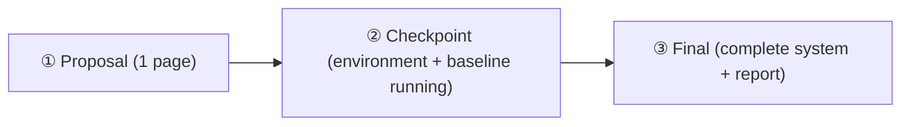

# Build Your Own World Model

**English** | [中文](README.md)

> Course capstone project: assemble everything from Labs 0–10 into a complete world-model system.
> Intended for: the shared capstone of both the Scientist Track and the Spatial Track.

---

## 1. Positioning and Objectives

In Labs 0–10, every lab's interface was defined for you: the environment was ready-made, the state was given, and the evaluation metrics were already written. The capstone requires you to complete a **full research exercise** — defining the interfaces yourself and assembling the course components into an end-to-end system:

```
observation → latent/world state → transition model → prediction → planning/policy → evaluation (including OOD)
```

**Hard constraint** (following the wording of the UPenn CIS 6280 Final Project): you must explore one world-modeling approach in an application domain and **explicitly declare** the modeled state, transition, action interface, and evaluation criteria. A vague "I trained a video prediction model" does not qualify; "the state is a 128-dimensional RSSM latent, the transition is an action-conditioned GRU + Gaussian head, the action is a 2D continuous force, and evaluation uses an ID/OOD comparison protocol" does.

**The goal is not how strong the model is, but:**

1. How clearly the interfaces are defined (whether the ten questions can be answered one by one);
2. How rigorous the evaluation is (statistical claims rather than "it looks like it works");
3. How honest the failure analysis is (failure cases and OOD behavior).

Compute budget: every direction has a tier achievable on Colab's free T4 — shrink the resolution / state dimension / data volume, and spend your effort on interface definition and evaluation rigor, which is where the points are.

---

## 2. Six Optional Directions

Each direction comes with: a one-sentence description, a suggested minimum viable scope (MVP), reusable lab components, and a difficulty rating (★ lowest, ★★★ highest).

### 2.1 Navigation (Navigation World Model)

- **Description**: Build a world model for a navigation agent and plan to the goal in imagination.
- **MVP**: A 2D grid or Lab 8's navigation environment + latent dynamics + MPC/CEM planning, reporting success rate as a function of planning horizon.
- **Reusable components**: Lab 0 (environment interface), Lab 2/3 (latent dynamics / RSSM), Lab 4 (MPC/CEM), Lab 8 (navigation world model), Lab 10 (OOD evaluation).
- **Difficulty**: ★★

### 2.2 Robot Manipulation

- **Description**: Learn an action-conditioned dynamics model for manipulation tasks (pushing, grasping, placing) and use it for control.
- **MVP**: A simplified 2D pushing environment (self-implemented or an off-the-shelf simulator), action-conditioned transition model + MPC; no real robot arm required.
- **Reusable components**: Lab 0 (custom environment), Lab 2 (latent dynamics), Lab 4 (MPC/CEM), Lab 9 (world model policy, as a baseline comparison).
- **Difficulty**: ★★★

### 2.3 Video Prediction (Action-Conditioned)

- **Description**: Build an action-conditioned video prediction model and evaluate its quality as an "imaginable world."
- **MVP**: A Moving-Ball-style rendered environment with a small ConvLSTM/diffusion-style predictor; report per-step prediction error as a degradation curve over the horizon.
- **Reusable components**: Lab 0 (environment rendering), Lab 2 (encoder/dynamics/decoder skeleton), Lab 7 (video prediction), Lab 10 (evaluation protocol).
- **Difficulty**: ★★

### 2.4 Dynamic 3D (Dynamic 3D/4D Worlds)

- **Description**: Build a queryable, persistent 3D/4D scene representation from multi-view or monocular video.
- **MVP**: A small synthetic scene (a few moving objects) → 4D Gaussians or a deforming NeRF → an "any time + any viewpoint" query interface, with a quantitative PSNR comparison against static reconstruction.
- **Reusable components**: Lab 5 (NeRF / Gaussian Splatting), Lab 6 (dynamic 4D worlds), Lab 10 (evaluation).
- **Difficulty**: ★★★

### 2.5 Game Environment (Game World Model)

- **Description**: Learn a world model for a small game and train a policy in imagination (a minimal Dreamer-style reproduction).
- **MVP**: A self-implemented simple game (grid collecting, simplified Atari-like), RSSM + actor-critic in imagination, comparing sample efficiency against a model-free baseline.
- **Reusable components**: Lab 0 (environment), Lab 3 (RSSM), Lab 9 (policy learning), Lab 10 (evaluation).
- **Difficulty**: ★★★

### 2.6 Spatial Memory (Spatial Memory and Queryable Representation)

- **Description**: Build a spatial world state that supports queries (rendering / collision / occupancy / semantics) and validate its value on a downstream task.
- **MVP**: An occupancy-grid or scene-graph representation + explicit query interfaces (collision queries, visibility queries) + a success-rate comparison between "planning with the representation" and an "end-to-end policy" on one navigation/manipulation task.
- **Reusable components**: Lab 5 (3D representation), Lab 6 (dynamic updates), Lab 8 (navigation), Lab 4 (planning).
- **Difficulty**: ★★

> Choosing another direction is entirely allowed, as long as it satisfies the hard constraint (explicit declaration of the four elements) and the scope is confirmed with the instructor/TA.

---

## 3. The Ten Unified Design Questions

No matter which direction you choose, **the final report must answer the following ten questions one by one** (the report template `template/report_template.md` is organized accordingly):

1. **What is the observation?** — What does the agent see? Dimensions, modality, noise characteristics.
2. **What is the latent/world state?** — What is the model's internal state? Explicit (positions / occupancy grid) or implicit (latent vector)? Why this choice?
3. **What is the action?** — Dimension of the action space, discrete/continuous, semantics.
4. **What is the transition model?** — The concrete parameterization of $p_\theta(s_{t+1} \mid s_t, a_t)$ and its training objective.
5. **How is memory maintained?** — How does the state accumulate and update over time? What is forgotten, what is kept?
6. **How is the future predicted?** — One-step or multi-step? How are open-loop rollouts generated?
7. **How is planning/policy performed?** — MPC/CEM, actor-critic, explicit geometric planning, or a hybrid?
8. **How is the model evaluated?** — Metrics (success rate, return, prediction error, PSNR…), test distributions, random seeds, and confidence intervals.
9. **What happens under OOD?** — How does performance degrade out of distribution (new dynamics parameters, new scenes, new disturbances)?
10. **What are the failure cases?** — At least three concrete failure cases, with analysis and possible causes.

---

## 4. Final Deliverables Checklist

| # | Deliverable | Requirements |
|---|-------------|--------------|
| 1 | Architecture diagram | One system diagram: the complete loop of observation → state → transition → prediction → planning → action |
| 2 | Training / evaluation curves | Training-loss and evaluation-metric curves (state the number of random seeds and the variance) |
| 3 | Prediction rollout | Visualization of at least one multi-step open-loop rollout (image sequence, trajectory, or rendered frames compared against ground truth) |
| 4 | Policy / planning result | Success rate / return on the defined task (compared against at least one baseline, e.g., a random policy or model-free) |
| 5 | OOD evaluation | ID vs OOD comparison table (can be generated with `template/evaluation_template.py`) |
| 6 | Failure cases | At least three concrete failure cases + analysis |
| 7 | Short report | 4–8 pages, organized following `template/report_template.md` |

---

## 5. Milestones



| Milestone | Deliverables | Pass criteria |
|-----------|--------------|----------------|
| **① Proposal** | 1-page document: chosen direction, declaration of the four elements (state / transition / action interface / evaluation criteria), 3–5 related papers, anticipated risks | All four elements explicitly written out, with no vague wording |
| **② Checkpoint** | Runnable environment + baseline (e.g., random policy + simple model) working + preliminary evaluation script + **analysis of the biggest technical risk and the fallback plan** | `evaluation_template.py` produces a metrics table when connected to your environment |
| **③ Final** | Complete system code + all deliverables from Section 4 + 4–8 page report | Ten questions answered one by one; evaluation includes statistics and an OOD comparison; failure cases are concrete and honest |

---

## 6. Evaluation Rubric

| Dimension | Weight | Full-marks standard |
|-----------|--------|---------------------|
| Design Clarity | 20% | Ten questions answered completely and precisely; the four-element declaration is unambiguous; the architecture diagram matches the implementation |
| Implementation | 30% | The system runs end to end; reused vs self-written parts are clearly marked; the code is reproducible (fixed seeds, explicit dependencies) |
| Evaluation Rigor | 25% | Metrics are defined, compared against baselines, and run with multiple random seeds/variance; the experimental setup is reproducible |
| OOD & Failure Analysis | 15% | Quantitative ID vs OOD comparison; ≥3 failure cases with root-cause analysis rather than a mere listing |
| Report Quality | 10% | Clear presentation within 4–8 pages; self-explanatory figures; accurate terminology |

**Common point deductions**: only a demo video with no quantitative evaluation; OOD described only qualitatively; failure cases written as "the model is sometimes inaccurate"; the four-element declaration mixing in implementation details instead of interface definitions.

---

## 7. Templates and Resources

- `template/report_template.md` — report template (organized by the ten questions; just fill in the blanks).
- `template/evaluation_template.py` — a runnable evaluation scaffold: success rate, mean return, one-step/multi-step prediction error, ID vs OOD comparison table. **Depends only on the standard library + numpy**; run `python3 evaluation_template.py` directly to see the output format.
- `template/project_structure.md` — recommended project directory structure and a guide to reusing lab components.

## 8. Links

- Course website module pages: [Track A · Capstone](../website/docs/scientist/13-capstone.mdx) ｜ [Track B · Capstone](../website/docs/spatial/13-capstone.mdx)
- Labs: [labs/](../labs/) (Lab 0 environment interface · Lab 1 Kalman · Lab 2 latent dynamics · Lab 3 RSSM · Lab 4 MPC/CEM · Lab 5 NeRF/Gaussian · Lab 6 4D · Lab 7 video prediction · Lab 8 navigation · Lab 9 MBRL policy · Lab 10 OOD evaluation)
- Course design document: [synthesis/proposed_course_v0_1.md](../synthesis/proposed_course_v0_1.md)
