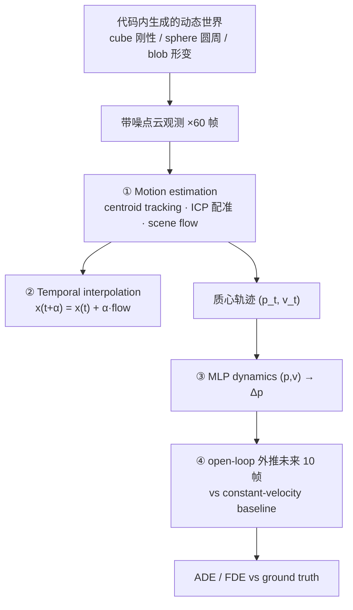

# Lab 6 · Dynamic 3D / 4D Worlds

[](https://colab.research.google.com/github/overdued/world-model-spatial-intelligence-course/blob/main/labs/lab06_dynamic_4d_worlds/notebook.ipynb)

Spatial 线：给静态 3D 表示加上时间轴。在代码内生成的三物体动态点云场景（刚性 cube / 圆周 sphere / 呼吸形变 blob，带噪声观测）上，完成 **motion estimation（centroid tracking + 手写 ICP 配准 + scene flow）→ temporal interpolation → MLP dynamics 学习 → 未来 10 帧外推**，并用 3D 动画把全程可视化。

## Goal

理解 4D 表示（3D + time）相对静态 3D 的本质增益：从"世界长什么样"到"世界下一秒在哪里"。不做大型 4D reconstruction，而是把 4D 世界模型的四个核心能力——运动估计、时间插值、动力学拟合、未来预测——在一个 CPU 几分钟跑完的玩具场景里逐一实现。

## You Will Learn

- 静态 (x, y, z) vs 动态 (x, y, z, t)：快照表示丢掉的是哪类状态变量
- 手写 ICP-style 刚性配准（nearest-neighbor 匹配 + Kabsch/SVD 迭代）与逐点 scene flow
- Temporal interpolation：用运动场在两帧之间合成中间时刻
- 3D 空间里的 world model prediction：MLP dynamics 自回归外推 vs constant-velocity 先验，ADE/FDE 评估
- Learned dynamics 的软肋：训练分布外的外推没有保证，open-loop 误差随 horizon 复涨

## Concept

一张点云是快照：几何完整，但没有索引时间的维度，因此原理上无法回答"下一秒在哪里"。4D 表示把运动与历史变成表示的一等公民。主流 4D 方法（DynamicFusion → D-NeRF → 4D-GS）共享"canonical space + deformation field"范式；本实验的 canonical 物体 + 逐帧运动变换是它的玩具版，centroid/scene flow 是微观动力学，MLP dynamics 外推则对应 world model 的 predict 步在 3D 空间的形态。

## Architecture



## Run

**Local**（CPU 即可，全程约 1–2 分钟）：

```bash
pip install -r requirements.txt
jupyter nbconvert --execute --to notebook --inplace notebook.ipynb
# 或交互式：jupyter notebook notebook.ipynb
```

**Colab**：[](https://colab.research.google.com/github/overdued/world-model-spatial-intelligence-course/blob/main/labs/lab06_dynamic_4d_worlds/notebook.ipynb)（首格自动安装依赖，无需 GPU）

## Experiment

核心对照（同一轨迹、同一 rollout 起点第 49 帧、外推未来 10 帧，唯一变量 = 动力学模型）：

| 组 | 动力学模型 | 参数量 |
|---|---|---|
| CV baseline | Δp = v（恒速先验） | 0 |
| MLP dynamics | (p, v) → Δp，2 层 hidden=32 | ~1.7k |

训练数据：前 49 帧的带噪质心轨迹（3 物体 × 49 transitions = 147 pairs），最后 10 帧留作评估。

## Expected Results

- **ICP 配准**：cube 相邻帧旋转估计误差约 **1–2°**，平移误差约 **0.02**（场景尺度 ~2）。
- **未来预测（10 帧，典型值）**：sphere（圆周运动）上 MLP 的 FDE ≈ **0.16**，CV ≈ **0.89**——learned dynamics 学到向心加速度，误差降到 1/5；cube（恒速直线）上 CV 反而更准（FDE ≈ 0.01 vs MLP ≈ 0.2），暴露 learned model 的外推软肋；blob（正弦浮动）上 MLP 小幅占优。
- **动画**：`assets/dynamic_scene.gif`（60 帧点云演化，相机环绕）、`assets/interpolation.gif`（两帧之间 4 个合成中间时刻的慢动作）、`assets/prediction.gif`（红色 MLP 预测点云 vs 蓝色实际，sphere/blob 上红色基本压住蓝色，cube 尾部可见漂移）。
- 其他产物：`assets/static_vs_dynamic.png`、`assets/scene_flow.png`、`assets/training_loss.png`、`assets/future_trajectories.png`、`assets/prediction_error.png`。

## Exercises

- ✏️ **非刚性形变**：把 `BREATH_AMP`/`BREATH_OMEGA` 调大，观察 scene flow、质心 tracking 与刚性平移预测假设谁先失效。
- ✏️ **多物体遮挡**：每帧随机丢点 30%（或按视线深度做有偏遮挡剔除），比较 centroid/ICP 误差变化，联系模块 05 的"观测不足"概念。
- ✏️ **预测 horizon**：`H = 5 / 20` 重跑，比较两个模型的 ADE/FDE 退化速度；观察 sphere 误差曲线的周期性结构。

## Advanced Extension

从玩具管线走向真实 4D 表示的路线（按范式组织）：

- **Scene flow 学习化**：把手写 NN 匹配换成 FlowNet3D 式的 learned flow，或 NSFP 式的 per-scene 优化——处理大位移、稀疏点与对称重复结构；
- **Canonical space + deformation field**：D-NeRF 用 MLP 形变场把任意时刻映射回规范空间，是 Section 6.1 线性插值的严格推广，支持**任意时刻 × 任意视角**查询；
- **4D Gaussian Splatting / Dynamic 3D Gaussians**：把高斯基元参数变成时间的函数，重建与 tracking 被统一为同一个优化，保留 3DGS 的实时渲染；
- **随机性与多模未来**：本实验世界是确定性的；接上 Lab 3 的 RSSM 思路，用 stochastic latent 表达"同一历史、多个未来"的 3D 版本。

## Related Modules

- [/docs/spatial/05-dynamic-4d-worlds](https://github.com/overdued/world-model-spatial-intelligence-course/blob/main/website/docs/spatial/05-dynamic-4d-worlds.mdx) — canonical + deformation 范式、scene flow、dynamic occupancy、观测不足
- [/docs/spatial/03-depth-and-point-clouds](https://github.com/overdued/world-model-spatial-intelligence-course/blob/main/website/docs/spatial/03-depth-and-point-clouds.mdx) — 点云观测的来源
- [/docs/spatial/06-state-estimation](https://github.com/overdued/world-model-spatial-intelligence-course/blob/main/website/docs/spatial/06-state-estimation.mdx) — 下一步：predict/update 交替的 3D tracking

## Related Papers

- Newcombe, Fox & Seitz (2015), *DynamicFusion: Reconstruction and Tracking of Non-rigid Scenes in Real-Time* (CVPR 2015).
- Pumarola et al. (2021), *D-NeRF: Neural Radiance Fields for Dynamic Scenes*. https://arxiv.org/abs/2011.13961
- Wu et al. (2024), *4D Gaussian Splatting for Real-Time Dynamic Scene Rendering*. https://arxiv.org/abs/2310.10642
- Luiten et al. (2024), *Dynamic 3D Gaussians: Tracking by Persistent Dynamic View Synthesis*. https://arxiv.org/abs/2310.08528
- Liu, Qi & Guibas (2019), *FlowNet3D: Learning Scene Flow in 3D Point Clouds*. https://arxiv.org/abs/1806.01411

## Common Problems

- **GIF 全黑或点看不到**：确认 `%matplotlib inline` 之后的 3D 图有输出；若 Colab 上 `ax.scatter` 的 `s` 太小可调到 8–10。
- **ICP 估计完全错误**：检查是不是把两个不同物体的点云喂进了 `icp_rigid`；NN 匹配要求帧间位移 < 点间距，加大 `OMEGA_CUBE`/`V_CUBE` 超过这个尺度必然失败——这本身就是 Exercise 的观察点。
- **MLP 在所有物体上都不如 CV**：多半是训练 epoch 不够或学习率过大导致没收敛（看 `training_loss.png` 是否降到 ~1e-6）；也可能是改了场景参数后运动不再满足 (p, v) 的 Markov 性（例如给 blob 加了不可由状态推断的时间依赖）。
- **prediction.gif 里 cube 红色点云越漂越远**：正常现象，不是 bug——cube 匀速直线漂移使 rollout 区间超出训练分布，正是 Section 7–9 讨论的 learned dynamics 外推软肋。
