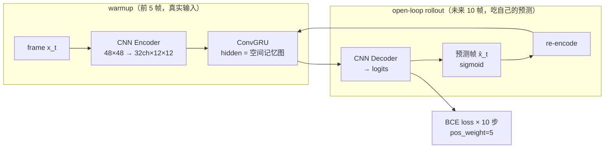

# Lab 7 · Video World Model

[](https://colab.research.google.com/github/overdued/world-model-spatial-intelligence-course/blob/main/labs/lab07_video_world_model/notebook.ipynb)

## Goal

在纯 CPU、几分钟内训练一个最小的 **video world model**：代码内生成 Moving Shapes 视频（3 个几何形状匀速运动 + 撞墙反弹，16 帧 48×48），用 **CNN Encoder + 手写 ConvGRU + CNN Decoder** 从前 5 帧预测未来 10 帧，并定量展示 **rollout degradation**（1-step → 5-step → 10-step 误差增长、帧序列从清晰到模糊拖影）。

## You Will Learn

- 为什么**视频预测是 world model 的生成式形态**（与 Lab 2 的 latent dynamics 是同一骨架的像素版）；
- **ConvGRU**：用 3×3 卷积实现 GRU gate，hidden state 是一张保留空间结构的"记忆图"（核心只有 4 行）；
- **Autoregressive rollout loss** vs teacher forcing：训练分布 = 部署分布，避免 exposure bias；
- **Long-horizon drift / compounding error**：预测帧喂回模型，误差随 horizon 累积放大；
- 为什么确定性 per-pixel 损失导致**预测模糊**（多模态未来的平均化）；
- 分布偏移（更快运动）如何让 drift 曲线整体上移 —— Lab 10 的预告。

## Concept

World model 的本质是"可以想象未来的模型"。Video prediction 把这个想象直接生成为像素帧：要预测未来，模型必须内化物体的惯性、反弹等物理规律。两个根本困难：

1. **多模态未来** → 确定性 MSE/BCE 模型输出"平均未来" → 模糊（blurriness）；
2. **Compounding error** → 预测被喂回自身 → 误差逐步放大 → drift。

大规模 video world model（VideoGPT、Genie、Sora）在概念上做同一件事，只是用离散 token + transformer 或 diffusion 来表达多模态未来，从而避免"平均化"。

## Architecture



## Run

**Local**（CPU，约 2–4 分钟）：

```bash
pip install -r requirements.txt
jupyter nbconvert --execute --to notebook --inplace notebook.ipynb
```

**Colab**：

[](https://colab.research.google.com/github/overdued/world-model-spatial-intelligence-course/blob/main/labs/lab07_video_world_model/notebook.ipynb)

## Experiment

Notebook 第 8 节内置 guided experiment：**fast-motion stress test** —— 不改模型、不重新训练，把测试集速度 ×2.5（mild OOD），重跑逐帧误差曲线，直观看到"one-step 退化温和、multi-step drift 被放大"。

## Expected Results

- 训练约 2–3 分钟（600 steps，batch 16，~68K 参数），loss 稳定下降；
- **GT vs Prediction 并排图**：context 帧一致，预测帧位置大致正确、随 horizon 渐糊，后期多形状糊成一团；
- **逐帧误差曲线**：1-step MSE ≈ 0.03，5-step ≈ 3–4×，10-step ≈ 5–6×（清晰展示 rollout degradation）；
- **预测 GIF**：`assets/prediction_rollout.gif`（左 GT 右预测同步播放）；
- **Speed stress**：×2.5 速度下整条误差曲线上移、斜率变陡；
- 产物：`assets/gt_vs_pred.png`、`assets/prediction_rollout.gif`、`assets/rollout_degradation.png`、`assets/speed_stress.png`。

## Exercises

- ✏️ **改预测长度**：把 `FUT` 从 10 改成 15（需要 `T=16` 加大到 21），观察误差曲线在什么 horizon 后饱和 —— 饱和点意味着什么？
- ✏️ **改帧数 / context 长度**：把 `CTX` 从 5 减到 2，1-step 误差会变差多少？context 里最少需要几帧才能推断出速度？
- ✏️ **改模型容量**：把 `H_CH` 从 32 调到 16 / 64，对比训练时间、1-step 锐度与 10-step 误差，找出 CPU 预算内的甜点。
- ✏️ **Action-conditioned 变体**：给每帧加全局"风力" `a_t ∈ R²`（在 `make_video` 里扰动速度），把动作通道拼接进 ConvGRU 输入；条件化后模型就能支持 Lab 4 式的"动作序列 → 想象轨迹"。
- ✏️ **Teacher forcing 对照**：把 `predict_future` 的 rollout 改成喂真实帧重训，对比 one-step loss 与 10-step rollout 误差（验证 exposure bias）。

## Advanced Extension

Notebook 末节给出概念图与文献地图（只讲不跑）：

- **离散 token + transformer**：VideoGPT（VQ-VAE + autoregressive transformer）、Genie（从无标注视频学 action-controllable world model）；
- **连续扩散**：Video Diffusion Models、Sora（spacetime patches + denoising transformer，天然表达多模态未来 → 不糊）；
- 与本 lab ConvGRU 的对比表：未来表达方式 / 时间建模 / 动作条件。

## Related Modules

- [/docs/scientist/10-video-world-models](https://github.com/overdued/world-model-spatial-intelligence-course/tree/main/website/docs/scientist/10-video-world-models.mdx) — 本 lab 对应的课程模块
- 前置：Lab 2 · Latent Dynamics（同一骨架的 latent 版）
- 后续：Lab 10 · OOD / Drift Evaluation（把本 lab 的 drift 现象系统量化）

## Related Papers

- Srivastava et al. (2015), *Unsupervised Learning of Video Representations using LSTMs*. https://arxiv.org/abs/1502.04681
- Shi et al. (2015), *Convolutional LSTM Network: A Machine Learning Approach for Precipitation Nowcasting*. https://arxiv.org/abs/1506.04214
- Denton & Fergus (2018), *Stochastic Video Generation with a Learned Prior* (SVG). https://arxiv.org/abs/1802.07687
- Yan et al. (2021), *VideoGPT: Video Generation using VQ-VAE and Transformers*. https://arxiv.org/abs/2104.10157
- Ho et al. (2022), *Video Diffusion Models*. https://arxiv.org/abs/2204.03458
- Bruce et al. (2024), *Genie: Generative Interactive Environments*. https://arxiv.org/abs/2402.15391
- OpenAI (2024), *Video generation models as world simulators* (Sora). https://openai.com/research/video-generation-models-as-world-simulators

## Common Problems

- **预测帧从第 1 步就很糊** → 训练不足：loss 还在降就把 `STEPS` 加 200；或学习率过低/过高（默认 3e-3）；
- **预测全黑或全灰** → 检查 decoder 输出是否忘了 `sigmoid`（训练用 logits，显示/回喂用 sigmoid）；亮像素稀疏，`pos_weight` 不要删；
- **形状身份串色（灰度错乱）** → `H_CH=32` 的瓶颈偏小，三个形状的灰度身份需要更多通道；试 `H_CH=64`（注意训练时间约翻倍）；
- **rollout 几步后形状消失** → 正常现象的一部分（drift），但若 3 步内就全黑，检查训练时是否真的用了 autoregressive rollout 而非 teacher forcing；
- **nbconvert 执行超时** → 把 `STEPS` 从 600 降到 400、`N_TRAIN` 从 768 降到 512，约 3 分钟可跑完（误差曲线形态不变）。
