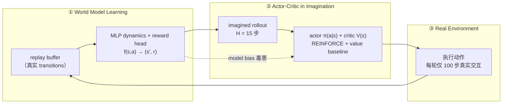

# Lab 9 · World Model + Policy（Tiny Dreamer）

[](https://colab.research.google.com/github/overdued/world-model-spatial-intelligence-course/blob/main/labs/lab09_world_model_policy/notebook.ipynb)

Scientist 主线的闭环实验：把 Lab 0–2 的部件（环境、latent dynamics）接上 policy，做一个 Tiny Dreamer-style 实验——**policy 主要在 world model 的 imagined trajectories 上训练**，并与 model-free baseline 对比样本效率，最后复现 model bias。

## Goal

在 goal-reaching 小球世界（Lab 0 物理改造）中实现完整三环闭环：用少量真实数据训练 world model（MLP dynamics + reward head），在 imagination 中用 REINFORCE + learned value baseline 训练 actor-critic，再回真实环境补少量数据。用真实环境步数作 x 轴，对比 Dreamer-style 与 model-free 的 reward 曲线。

## You Will Learn

- Dyna / Dreamer 的三环闭环：World Model Learning → Actor-Critic in Imagination → Real Environment
- Imagined rollout 上的 actor-critic 更新（bootstrap value、advantage、entropy bonus）
- 样本效率的正确会计方式：x 轴 = 真实环境步数，imagination 步数免费
- Model bias / model exploitation：policy 如何钻模型误差的空子，以及如何复现与防御

## Concept

Model-free RL 的每个梯度都来自真实交互；model-based 把这笔账拆开——真实样本只用于**校准模型**，policy 的梯度信号主要来自模型内部的想象。本 Lab 用完全相同的 actor-critic 结构与超参做对照：唯一变量是轨迹来自真实环境还是学出来的 world model。

## Architecture



## Run

**Local**（CPU 即可，全程约 2–5 分钟）：

```bash
pip install -r requirements.txt
jupyter nbconvert --execute --to notebook --inplace notebook.ipynb
# 或交互式：jupyter notebook notebook.ipynb
```

**Colab**：[](https://colab.research.google.com/github/overdued/world-model-spatial-intelligence-course/blob/main/labs/lab09_world_model_policy/notebook.ipynb)（首格自动安装依赖，无需 GPU）

## Experiment

核心对照实验（同一 ActorCritic、同一超参，唯一变量 = 轨迹来源）：

| 组 | 轨迹来源 | 真实样本预算 |
|---|---|---|
| Dreamer-style | 2500 步随机种子数据训 world model；之后每轮 50 次 imagination 更新 + 仅 100 步真实采集 | **5,000 步** |
| Model-free | 直接在真实环境做 policy gradient（16 episodes/更新） | 50,000 步（10×） |

附加实验：把 reward 重标为 sparse（到达 +1）并对稀有正样本加权训练 reward head，让 actor 纯在想象中训练 600 次更新——观察 imagined return（模型自评）与 real return（真实兑现）的分离，即 model bias。

## Expected Results

- **样本效率**：Dreamer-style 约 **2,800–3,500 真实步**内 success rate 达到 ≥0.9，最终 return ≈ **-1.4**（success 1.0）；model-free 在 5,000 步时仍接近随机水平（return ≈ -20，success ≈ 0.3），即使给足 **10 倍预算（50k 步）**也只到 return ≈ -10 / success ≈ 0.7–0.8，未能追平。
- **Imagined vs real rollout**：同一动作序列下，想象轨迹前 ~10 步紧贴真实轨迹（平均位置误差 < 0.05），随后缓慢 drift（compounding error，呼应 Lab 2）。
- **Model bias（可复现）**：sparse-reward 实验中 imagined return 爬升至 ~40 而 real return 停在 ~1——policy 停在 reward head 被抹大的假高奖励区"刷分"。
- 产物：`assets/reward_curves.png`、`assets/imagined_vs_real.png`、`assets/policy_trajectories.png`、`assets/model_bias.png`、`assets/learned_policy.gif`。

## Exercises

- ✏️ **Imagination horizon**：把 `H_IMAG` 改成 5 / 40 重跑，观察短视 vs 误差复敌对最终 return 的影响。
- ✏️ **想象/真实比例**：调整 `(UPDATES_PER_ITER, REAL_PER_ITER)`，找样本效率最优的比例，并观察想象过剩时是否出现 model bias 迹象。
- ✏️ **Model bias 与数据量**：把稀疏实验的种子数据从 2500 步减到 800 步，观察 imagined–real gap 如何变化。

## Advanced Extension

向完整 Dreamer 升级的路线图（按收益排序）：

- **λ-return**：把固定 horizon 的 n-step return 换成指数加权的多步 return 混合，更平滑地权衡 bias/variance；
- **解析梯度回传（analytic gradients）**：去掉 imagination 里的 `no_grad`，让梯度穿过 dynamics 直接回传到 actor（Dreamer 的 stochastic backpropagation），方差远低于 REINFORCE；
- **symlog 预测与 two-hot reward**：压缩 reward 尺度、稳定大范围回报的学习（DreamerV3 的关键 trick）；
- **KL balancing / RSSM**：把确定性 MLP 换成随机状态空间模型，用 KL balancing 训练——处理 partial observability 与多模态未来；
- **图像 observation**：接回 Lab 2 的 ConvEncoder，在 latent space 里跑同一个闭环。

## Related Modules

- [/docs/scientist/11-world-model-policy](https://github.com/overdued/world-model-spatial-intelligence-course/blob/main/website/docs/scientist/11-world-model-policy.mdx) — Dyna → Dreamer → DayDreamer 的闭环全景与 model bias 工具箱
- [/docs/scientist/08-dreamer](https://github.com/overdued/world-model-spatial-intelligence-course/blob/main/website/docs/scientist/08-dreamer.mdx) — Dreamer 系列的 imagination 训练细节

## Related Papers

- Hafner et al. (2019), *Dream to Control: Learning Behaviors by Latent Imagination* (DreamerV1). https://arxiv.org/abs/1912.01603
- Hafner et al. (2023), *Mastering Diverse Domains through World Models* (DreamerV3). https://arxiv.org/abs/2301.04104
- Hansen et al. (2022), *Temporal Difference Learning for Model Predictive Control* (TD-MPC). https://arxiv.org/abs/2203.04955

## Common Problems

- **Model-free 曲线早期比随机还差**：正常现象。policy gradient 早期让 policy 快速远离均匀随机（commit 到未成熟的动作偏好），greedy eval 放大了这一点；随样本增加会恢复并超过随机。
- **两条曲线没拉开**：检查 x 轴是否是"真实环境步数"而非更新次数；确认 Dreamer 组的 imagination 更新数足够（每轮 ≥50 次）。
- **Model bias 复现不出来**：gap 依赖 reward head 的外推误差——数据太多（正样本太充分）或 `pos_weight` 太小都会让 gap 缩小；按第 8 节默认设置（主实验 buffer、pos_weight=50）可稳定复现 imagined ≈ 40 vs real ≈ 1 的分离。
- **Colab 上变慢**：确认没有误开 GPU 之外的加速设置反而引入开销；本 Lab 纯 CPU 设计，Colab CPU runtime 与原计划时间一致。
