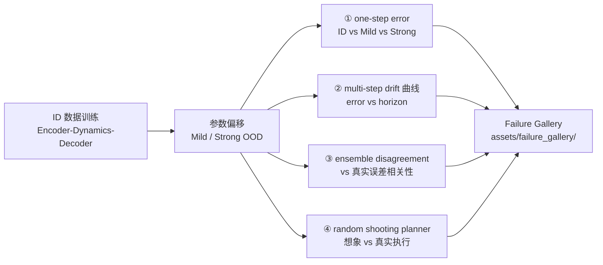

# Lab 10 · OOD / Drift Evaluation

**中文** | [English](README_EN.md)

[](https://colab.research.google.com/github/overdued/world-model-spatial-intelligence-course/blob/main/labs/lab10_ood_drift_evaluation/notebook.ipynb)

## Goal

训练一个 Lab 2 风格的 latent dynamics model（只用 ID 数据），然后在受控的 **distribution shift**（Mild / Strong OOD）下完成一次完整的可靠性评估闭环：**one-step error → multi-step drift → uncertainty proxy → planning / policy failure**，并自动生成 Failure Gallery。

## You Will Learn

- 为什么 **one-step prediction error 不能代表 world model 的部署质量**；
- 如何用参数化模拟器制造分级的 OOD 条件（速度 / 摩擦 / 反弹 / 噪声 / 遮挡）；
- **Compounding error / drift**：open-loop rollout 中误差如何随 horizon 超线性增长；
- 用 **ensemble disagreement** 做廉价 uncertainty proxy，并检验它与真实误差的相关性；
- **prediction error → planning error → policy failure** 的完整失效链条（random shooting planner）；
- 建立 Failure Gallery 作为模型迭代时的定性审计资产。

## Concept

World model 的评估应覆盖四个维度（对应 CIS6280 L23 评估框架）：

1. **Accuracy** — ID 上的 one-step / multi-step 误差；
2. **Robustness** — 同样的指标在 Mild / Strong OOD 下退化多少；
3. **Calibration / Uncertainty** — 模型能否在自己不可靠时给出信号（ensemble disagreement）；
4. **Downstream utility** — 用模型做 planning 时，误差如何转化为 policy failure。

核心现象：**one-step error 随 shift 平缓上升，multi-step rollout error 却急剧爆炸** —— 单步误差被当作下一步输入而放大，OOD 物理下放大的更快。

## Architecture



## Run

**Local**（CPU，约 3–5 分钟）：

```bash
pip install -r requirements.txt
jupyter nbconvert --execute --to notebook --inplace notebook.ipynb
```

**Colab**：

[](https://colab.research.google.com/github/overdued/world-model-spatial-intelligence-course/blob/main/labs/lab10_ood_drift_evaluation/notebook.ipynb)

## Experiment

Notebook 第 12 节内置 guided experiment：**speed sweep**（×1.0 → ×3.0，其余参数保持 ID），对比 one-step 与 8-step rollout error 的归一化增长曲线，直观看到 "one-step 退化平缓、multi-step 爆炸"。

## Expected Results

- ID 上 reconstruction 清晰、one-step 预测对准（健康检查通过）；
- one-step error：Mild 略高于 ID，Strong 显著更高（柱状图，log scale）；
- **Drift 曲线**：三种条件并排，t=1 时差距小，t=12 时 Strong OOD 差出约一个数量级；
- Ensemble disagreement 随 shift 单调上升，与真实误差正相关（Pearson r ≈ 0.6–0.9，散点图三色分层）；
- Planning：同一计划轨迹，ID 执行基本到达目标（★），Strong OOD 执行明显偏离 —— policy failure；
- `assets/failure_gallery/` 生成 4 张 PNG（3 条最差 rollout 拼图 + 1 张 planning 失败图）与 `captions.txt`。

## Exercises

- ✏️ **设计新的 OOD shift**：在 `CONDITIONS` 之外自定义一组参数（例如摩擦各向异性、时变速度、移动遮挡条），预测它在哪个评估层面最先暴露，然后跑实验验证。
- ✏️ **Uncertainty 阈值拒判**：用 ensemble disagreement 设一个阈值 τ，让 planner 在 disagreement > τ 时拒绝执行（abstain）。扫描 τ，画出"拒判率 vs 成功率"曲线，找出 ID 上不误拒、Strong OOD 上能拒判的区间。
- ✏️ **集成数量的影响**：把 K 从 1 扫到 9，观察 disagreement–error 相关系数与评估开销的变化；K=1（单模型、无 uncertainty）时失效链条哪里最先断？

## Advanced Extension

- **Deep Ensembles / PETS 式规划**：用 ensemble mean 做预测、disagreement 作 cost 惩罚项（uncertainty-penalized MPC），量化对 OOD policy failure 的缓解；
- **Calibration**：把 disagreement 分桶，画 reliability diagram（predicted uncertainty vs empirical error），计算 ECE；
- **更系统的评估维度**：对照 CIS6280 L23 的框架补全 accuracy / calibration / robustness / downstream utility 四维报告卡（model card）。

## Related Modules

- [/docs/scientist/12-ood-drift-evaluation](https://github.com/overdued/world-model-spatial-intelligence-course/tree/main/website/docs/scientist/12-ood-drift-evaluation.mdx) — 本 lab 对应的课程模块
- 前置：Lab 2 · Latent Dynamics（模型与训练流程）、Lab 4 · MPC / CEM Planning（更完整的 planner）

## Related Papers

- Chua et al. (2018), *Deep Reinforcement Learning in a Handful of Trials using Probabilistic Dynamics Models* (PETS). https://arxiv.org/abs/1805.12114
- Lakshminarayanan et al. (2017), *Simple and Scalable Predictive Uncertainty Estimation using Deep Ensembles*. https://arxiv.org/abs/1612.01474
- Hafner et al. (2019), *Learning Latent Dynamics for Planning from Pixels* (PlaNet). https://arxiv.org/abs/1811.04551
- Ha & Schmidhuber (2018), *World Models*. https://arxiv.org/abs/1803.10122
- Venkatraman et al. (2015), *Improving Multi-Step Prediction of Learned Time Series Models*. https://arxiv.org/abs/1502.04991

## Common Problems

- **Strong OOD 下 rollout 立刻发散、曲线没有"逐渐崩溃"的形态** → Strong 的 speed/friction 太激进，先把 speed 降到 ×2.0 观察过渡形态；
- **Uncertainty 散点图三色混在一起、相关性弱** → ensemble 训练步数太少或初始化种子相同；确认每个 member 用不同的 `torch.manual_seed`；
- **Planner 在 ID 上也到不了目标** → 先检查 ID 上 one-step position error（应 < 0.1）；再增大 `n_samples` 或 `horizon`；
- **预测帧过灰导致 soft-argmax 质心漂到画面中心** → 说明 open-loop rollout 已发散（这正是 drift 的表现）；若在 step-1 就发生，检查 decoder 输出是否需要 sigmoid；
- **nbconvert 执行超时** → 把 `STEPS` 从 800 降到 600，rollout 的 `n_roll` 从 48 降到 32。
