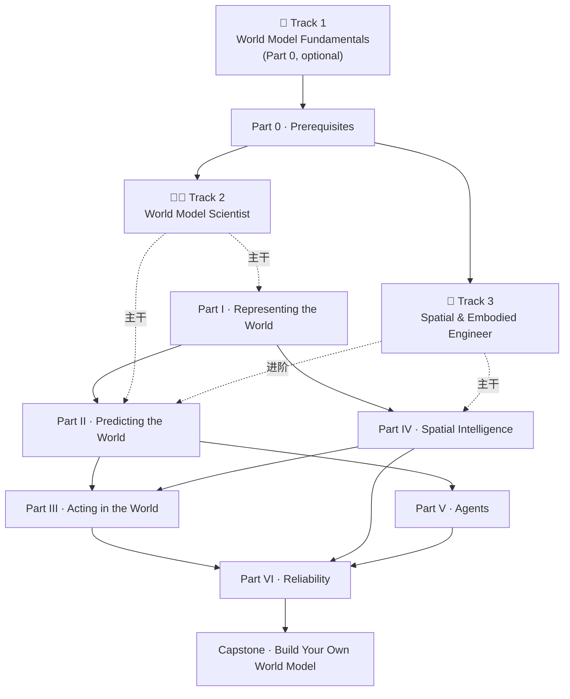

# 《World Models & Spatial Intelligence》开源课程设计 V0.1

> **课程名**：World Models & Spatial Intelligence
> **副标题**：From Representation to Prediction, Planning and Physical Intelligence
> **文档版本**：v0.1（设计草案）
> **撰写日期**：2026-09-26
> **知识库基础**：本设计基于对全球 11 门相关课程的调研（UPenn CIS6280 World Models、Stanford CS231A、CMU 16-825、MIT VNAV、ETH/UZH VAMR、UCSD ML Meets Geometry、Berkeley CS294-173、Cornell CS6672、TUM DL4SpatialAI、Columbia Spatial AI、Harvard GSD Spatial Intelligence），以及对开源课程模板 [mlabonne/llm-course](https://github.com/mlabonne/llm-course)（Apache-2.0）的深度分析（见 `synthesis/course_design_lessons.md`）。

---

## 0. 文档说明

本文档是《World Models & Spatial Intelligence》开源课程的第一版设计方案（V0.1）。它不是课程内容本身，而是课程的**架构蓝图**：回答"这门课给谁开、为什么这样组织、学什么、怎么动手、怎么开源维护"五个问题。

写作立场：

- 我们是**课程的策展者与设计者**，不是全部内容的原创作者。课程本体以精选外链承载知识（论文、官方文档、社区公认最佳教程），原创精力集中在结构、串联语、roadmap 与 notebook 上。
- 调研所得的 11 门课程是本设计的**素材库与坐标系**：每一处课程树节点都尽量标注其参考来源，保证可溯源、可复核。
- 本设计刻意模仿 llm-course 的成功要素（分轨、单 README、四段式章节、Colab 外链、策展式引用），但不复制其内容；所有文字均为原创撰写。

---

## 1. 课程定位与目标读者、设计理念

### 1.1 课程定位

**World Models & Spatial Intelligence** 是一门面向研究生与高年级本科生的开源课程，主题是**世界模型（World Models）与空间智能（Spatial Intelligence）的交叉**：智能体如何从观测中学习世界的表示（Representation），如何在学到的表示中预测未来（Prediction），如何基于预测进行规划与行动（Planning & Acting），以及这一切如何落到 3D 空间理解、机器人与具身智能（Physical Intelligence）上。

课程的问题意识来自一个观察：截至 2026 年，世界模型已经从一篇 2018 年的 NeurIPS workshop 论文（Ha & Schmidhuber, *World Models*）演化为横跨强化学习（Dreamer 系列、TD-MPC）、生成建模（视频世界模型、Genie、Sora 类系统）、3D 视觉（NeRF、Gaussian Splatting、4D 动态表示）、机器人（VLA、world-action models）与 LLM 智能体（LLM as world model）的大领域，但**尚无一门面向自学者的、覆盖全谱系的开源课程**。UPenn CIS6280（2026 秋首次开课）证明了这一主题足以支撑一整门研究生课程；我们的目标是把它做成一个人人可学的开源版本。

### 1.2 目标读者

- **主要读者**：具备机器学习基础（研究生级 ML 课程或同等自学经验，对标 CIS 5190/5200 的先修要求）、希望进入世界模型 / 空间智能 / 具身智能方向的研究者与工程师。
- **次要读者**：已在做 LLM/计算机视觉/机器人某一个子方向、希望系统补齐"世界模型"这块拼图的从业者。
- **非目标读者**：零基础学习者（请先修 Part 0 列出的外部课程后再来）；只想用现成 API 调视频生成模型的应用开发者。

### 1.3 设计理念：如何借鉴 llm-course 模板

我们对 mlabonne/llm-course 做了逐节分析（详见 `synthesis/course_design_lessons.md`），提炼出以下可迁移的设计决策，并在本课程中全部采纳或改造：

**（1）按职业身份（persona）分轨，而不是按难度堆章节。**
llm-course 最大的创新是用 Fundamentals / Scientist / Engineer 三个角色组织内容，角色名直接对接就业市场叙事。本课程对应设三轨（见第 2 节）：World Model Fundamentals → World Model Scientist（造模型）→ Spatial & Embodied Engineer（造系统）。三轨呈"Y 字形"：共享地基，按需分轨。

**（2）一门课 = 一个 README 的信息架构。**
llm-course 把 83k star 的课程装进一个 459 行的 README，零目录层级、首屏即定位。本课程的最终发布形态也采用单 README（`README.md` 即课程），辅以 `notebooks/` 外链表与 `img/` roadmap 图；调研材料、版本草案（如本文档）留在 `synthesis/` 不进主线。

**（3）每章固定四段式模板。**
llm-course 全文约 20 个章节共用同一模板：①一段话定位（为什么学）→ ②加粗知识点（学什么）→ ③📚 精选 References（读什么）→ ④分隔线。本课程的每个课程树节点也按此四段式展开，降低认知负荷，让学习者形成稳定的阅读预期。本设计文档中，我们用"一句话定位 + 知识点 + 参考来源"的压缩版呈现，发布版再补全 References。

**（4）章节顺序 = 真实研究/工程管线顺序。**
llm-course 的 Scientist 轨就是 LLM 生产流程（预训练→对齐→评估→量化），Engineer 轨就是应用生产流程（RAG→agent→部署→安全）。本课程的课程树（第 3 节）同样按管线组织：表征世界（Part I）→ 预测世界（Part II）→ 在世界中行动（Part III）→ 空间智能落地（Part IV）→ 智能体扩展（Part V）→ 可靠性收尾（Part VI）。这条线直接继承 CIS6280 的 "Representation / Prediction / Interaction" 三主线，并把空间智能单列成 Part IV。

**（5）Roadmap 图作为全局地图。**
每个 track 配一张视觉 roadmap 图（风格致敬 roadmap.sh），共用一套视觉语言；学习者任何时刻都知道自己在哪。详见第 5 节。

**（6）Notebook 托管 Colab，追求 one-click 可跑。**
仓库内不放 ipynb，所有动手实验以 Colab 徽章按钮外链，设计约束为**免费 GPU 可跑**（小模型、小数据集、预计算资产）。详见第 4 节与第 6 节。

**（7）策展式引用，论文内嵌于知识点。**
References 统一格式"标题 + by 作者 + 一句话说明"；论文作为知识点的脚注出现，不单列 Reading List。领域更新太快，另设 New Trends 缓冲章节吸收新内容（本设计中并入 Part VI 之后的附录规划）。

**（8）开源协议建议：内容 CC BY 4.0 + 代码 MIT。**
llm-course 用 Apache-2.0（对文字课程而言少见但更宽松）。我们建议采用学术界更通行的双协议：**课程文字、讲义、图采用 CC BY 4.0**（署名即可自由使用，包括商用），**Lab 代码与 notebook 脚本采用 MIT**（代码场景的标准宽松协议）。两者都满足"开源课程"的最低摩擦要求，且比单一 Apache-2.0 更贴合"内容 + 代码"混合仓库的惯例。详细讨论见第 6 节。

### 1.4 与 11 门调研课程的关系

本课程不是 11 门课的拼盘，而是**以 CIS6280 为主骨架、其余 10 门课为专题纵深**的再组织：

| 本课程组件 | 主要参考来源 | 借用什么 |
|---|---|---|
| 总体骨架（表征→预测→行动） | UPenn CIS6280 | 三主线 + 四单元结构、期末项目模板 |
| 状态空间模型 / 滤波 | Stanford CS231A、CIS6280 L04 | PS4 风格的 Kalman filter 编程作业 |
| 3D 表示（NeRF/GS） | CMU 16-825 | A3/A4 作业设计（体积渲染、点云、NeRF、Gaussian Splatting） |
| SLAM / VIO / 导航 | MIT VNAV、ETH/UZH VAMR | EuRoC 数据集评估、VIO 管线教学 |
| 几何学习 | UCSD ML Meets Geometry、TUM DL4SpatialAI | 几何深度学习专题 |
| 空间智能叙事 | Columbia Spatial AI、Harvard GSD Spatial Intelligence、Berkeley CS294-173、Cornell CS6672 | "spatial intelligence" 的概念框架与前沿专题 |

---

## 2. Three Learning Tracks

仿照 llm-course 的 🧩 Fundamentals / 🧑‍🔬 Scientist / 👷 Engineer 三层结构，本课程设三个学习轨道。三轨不是难度递进，而是**共同地基 + 两个平行出口**。

### 🧩 Track 1: World Model Fundamentals（地基，按需回查）

- **目标**：补齐学习世界模型所需的数学与机器学习地基，不作为强制起点。
- **受众**：从其他方向转来、基础有缺口的学习者；或学过但生疏、需要"用到再回来查"的人。
- **内容范围**：线性代数、概率论、PyTorch 与深度学习基础、Transformer、计算机视觉、强化学习（对应课程树 Part 0）。
- **出口**：任何一章学完后可直接跳回 Track 2 或 Track 3 的对应节点。明确标注 "optional, refer to it as needed"——反对线性学习，主张按需回查。
- **学习验证**：无作业；以"能读懂 Track 2 对应章节的公式与代码"为标准。

### 🧑‍🔬 Track 2: World Model Scientist（造模型）

- **目标**：学会**构建**世界模型——从表征学习、动力学建模到生成式视频预测，再到评估。对应真实研究管线：数据/仿真 → 表示学习 → 动态模型 → 生成模型 → 评估。
- **受众**：想做世界模型方向研究（发论文、读 PhD、进研究实验室）的学习者。
- **内容范围**：课程树 Part I（表征）、Part II（预测）、Part VI（可靠性评估）为主干，Part III 的规划与 model-based RL 为必学应用，Part V 为前沿延伸。
- **对应 Labs**：Lab 1–4（SSM/潜动态/RSSM/MPC）、Lab 7（视频世界模型）、Lab 9（MBRL 闭环）、Lab 10（OOD/Drift 评估）。
- **出口**：能复现 Dreamer / TD-MPC 级别的系统；能在一个新环境上定义 state/transition/action interface 并训练、评估一个世界模型（Capstone 的直接能力）。职业叙事：World Model Researcher / Research Engineer。

### 👷 Track 3: Spatial & Embodied Engineer（造系统）

- **目标**：学会**用**世界模型与空间表示造系统——从 3D 感知、SLAM 到规划与机器人部署。对应真实工程管线：传感器 → 3D 重建/表示 → 状态估计（SLAM/VIO）→ 规划 → 机器人闭环。
- **受众**：机器人、自动驾驶、AR/VR、空间计算方向的工程师与研究者。
- **内容范围**：课程树 Part I 的几何表示部分（Geometry/Depth/Point Cloud/NeRF/Gaussian Splatting）、Part IV（Spatial Intelligence）为主干，Part III 的规划与 Robot Learning 为必学应用，Part II 的视频/4D 预测为进阶。
- **对应 Labs**：Lab 5（NeRF/GS）、Lab 6（4D 表示）、Lab 8（机器人导航）、Lab 9（闭环）、Lab 10（鲁棒性评估）。
- **出口**：能搭建一个"感知-状态估计-规划"的完整空间智能系统并在仿真/基准数据上评估。职业叙事：Spatial AI Engineer / Robotics Perception Engineer。

**两轨关系说明**：Scientist 与 Engineer 是**平行而非先后**关系——造视频世界模型的人不必学 SLAM，做 SLAM 的人不必学 flow matching；但两者共享同一个问题（什么是世界的"状态"、如何预测它、预测错了怎么办），这正是 Fundamentals 与 Part VI（可靠性）作为共同地基的原因。

---

## 3. Curriculum 课程树

以下为课程主线内容，按六个 Part 组织。每个节点给出：**一句话定位 / 3–5 个知识点 / 参考来源**（标注调研课程的具体 lecture 或作业，如"参考 CIS6280 L08"）。

### Part 0 · Prerequisites（先修，对应 Track 1）

**定位**：世界模型的地基。全部标记为可选、按需回查；每个节点只列"够用的最小集"，不做完整课程。

- **0.1 Linear Algebra**
  定位：理解状态向量、观测矩阵与变换的代数语言。
  知识点：向量空间与基底；矩阵分解（SVD/特征分解）；线性最小二乘；坐标变换与齐次坐标。
  参考：Stanford CS231A 先修要求；3Blue1Brown 线代系列（策展外链）。

- **0.2 Probability**
  定位：世界模型的概率化语言——不确定性是这个领域的母语。
  知识点：条件分布与贝叶斯；高斯分布与协方差；马尔可夫性；隐变量与边际化；期望与蒙特卡洛估计。
  参考：CIS6280 L02（trajectory distribution、partial observability 的概率形式化）。

- **0.3 PyTorch**
  定位：所有 Lab 的实现工具，只需工程够用水平。
  知识点：tensor 与自动微分；`nn.Module` 与优化器；DataLoader；混合精度与 checkpointing；GPU 显存管理常识。
  参考：PyTorch 官方教程（策展外链）；llm-course Fundamentals 的 Python for ML 章节设计。

- **0.4 Deep Learning**
  定位：理解表征学习的基本构件。
  知识点：MLP/CNN 基础；反向传播与优化（SGD/Adam）；归一化与初始化；过拟合与正则化；VAE 与 ELBO 入门。
  参考：CIS6280 L07（潜变量模型与对抗模型）。

- **0.5 Transformer**
  定位：当代世界模型（视频、时序、agent）的主干架构。
  知识点：自注意力机制；位置编码与 RoPE；自回归生成与采样；KV cache；多模态 token 化。
  参考：CIS6280 L12–L13（时空生成架构）；nanoGPT（策展外链）。

- **0.6 Computer Vision**
  定位：观测建模的视觉基础——世界模型的"眼睛"。
  知识点：相机模型与内外参；多视几何基础；深度估计；特征提取与匹配；图像生成模型概览。
  参考：Stanford CS231A（全课）；CMU 16-825（全课）。

- **0.7 Reinforcement Learning**
  定位：世界模型用于决策的最小 RL 背景——明确"这不是一门 RL 课"（借用 CIS6280 的官方声明）。
  知识点：MDP 与 Bellman 方程；value/policy 函数；model-free vs model-based；policy gradient 与 actor-critic；探索与利用。
  参考：CIS6280 课程声明与 L10（imagination 中的 policy/value 学习）；Sutton & Barto（策展外链）。

---

### Part I · Representing the World（表征世界）

**定位**：什么是"世界的表示"？从观测与状态的区分讲起，到潜空间表示，再到显式 3D 几何表示。这是 Track 2 与 Track 3 的共同起点，也是本课程区别于纯 RL 课程的第一块特色内容。

- **1.1 Observation vs State**
  定位：世界模型的第一性问题——你建模的到底是"看到的"还是"真实的"。
  知识点：完全观测 vs 部分可观测（POMDP）；观测空间 vs 状态空间；马尔可夫性与充分统计量； belief state；历史压缩问题。
  参考：CIS6280 L02（历史、基础与概率形式化）、L03（环境与模拟器接口）。

- **1.2 Latent State**
  定位：学习一个紧凑的潜状态，而不是在原始像素上建模。
  知识点：潜变量模型回顾（VAE/ELBO）；潜状态的设计准则（可预测、可控、信息充分）；维度与信息瓶颈；潜空间的可解释性。
  参考：CIS6280 L07、L08。

- **1.3 State Space Model**
  定位：经典的状态-观测框架，是 learned world model 的基准与先驱。
  知识点：LGSSM（线性高斯状态空间模型）；Kalman filter 预测-更新循环；扩展/无迹 Kalman filter；从 LGSSM 到 learned SSM 的谱系。
  参考：CIS6280 L04（含手写推导笔记）；Stanford CS231A PS4；dynamax 库（probml）。

- **1.4 Representation Learning**
  定位：好的表示让预测变简单——表示质量决定世界模型上限。
  知识点：什么使表示"好"（下游可迁移、预测充分）；重建式 vs 预测式目标；坍塌问题；表示评估协议（linear probe 等）。
  参考：CIS6280 L05。

- **1.5 Self-supervised Learning**
  定位：世界模型的数据引擎——无需标签地从观测流中学习。
  知识点：对比学习（InfoNCE）；掩码建模（MAE 式）；时序预测式 SSL；多视图/多帧一致性。
  参考：CIS6280 L05–L06。

- **1.6 JEPA**
  定位：LeCun 路线的世界模型——在抽象表示空间中预测，放弃像素级重建。
  知识点：Joint-Embedding Predictive Architecture；I-JEPA / V-JEPA；能量模型视角；与生成式路线的争论（重建 vs 预测）。
  参考：CIS6280 L06；V-JEPA / V-JEPA 2 官方资料（策展外链）。

- **1.7 Geometry**
  定位：3D 空间智能的几何语言——相机、变换与多视约束。
  知识点：针孔相机与投影；外参/内参与畸变；对极几何与基础矩阵；三角化；坐标系约定（世界/相机/本体）。
  参考：Stanford CS231A；ETH/UZH VAMR；UCSD ML Meets Geometry。

- **1.8 Depth**
  定位：从 2D 到 3D 的第一座桥。
  知识点：立体匹配与视差；单目深度估计；深度传感器（LiDAR/ToF/RGB-D）；深度的不确定性与有效区间。
  参考：CS231A；TUM DL4SpatialAI。

- **1.9 Point Cloud**
  定位：最通用的显式 3D 表示。
  知识点：点云数据结构；采样与配准（ICP）；PointNet 系特征学习；occupancy 与 SDF 表示；点云与体素的取舍。
  参考：CMU 16-825 A2–A3 风格作业；MIT VNAV。

- **1.10 Mesh**
  定位：图形学的经典表示，连接重建与仿真。
  知识点：三角网格与拓扑；可微渲染初步；从点云/SDF 到 mesh（Marching Cubes）；mesh 在物理仿真中的角色。
  参考：CMU 16-825；CIS6280 L17（neural physics 的 mesh 模拟器）。

- **1.11 NeRF**
  定位：神经辐射场——用神经网络隐式表示一个静态场景。
  知识点：辐射场与体积渲染方程；位置编码；粗-细采样；训练与渲染管线；NeRF 的局限（慢、静态）。
  参考：CMU 16-825 A4 风格作业；NeRF 原论文（Mildenhall et al., 2020）。

- **1.12 Gaussian Splatting**
  定位：显式高斯基元的实时可微渲染——当前 3D 表示的工程主流。
  知识点：3D 高斯参数化（位置/协方差/颜色/不透明度）；splatting 与光栅化；自适应密度控制；与 NeRF 的对比（显式 vs 隐式、速度 vs 质量）。
  参考：CMU 16-825 后续作业设计；3DGS 原论文（Kerbl et al., 2023）；CIS6280 L15。

---

### Part II · Predicting the World（预测世界）

**定位**：有了表示，如何预测它的演化？从经典动力学模型到 Dreamer 式潜空间预测，再到 diffusion/flow 驱动的视频世界模型与 4D 动态表示。这是 Track 2 的核心。

- **2.1 Dynamics Models**
  定位：转移函数 p(s'|s,a) 是学习对象，先建立一般图景。
  知识点：确定性 vs 随机动力学；one-step vs multi-step 目标； rollout 与误差累积初识；动力学模型的训练数据来源；物理先验的注入。
  参考：CIS6280 L02、L04。

- **2.2 RSSM**
  定位：Recurrent State Space Model——Dreamer 系列的骨架，确定性与随机性混合的潜动力学。
  知识点：recurrent 状态 + 随机状态的分解；prior/posterior 与 KL 正则；表征与预测的统一训练；RSSM 的变体（离散潜变量等）。
  参考：CIS6280 L08；PlaNet（Hafner et al., 2019）。

- **2.3 World Models**
  定位：2018 年的原点论文，理解"在梦中训练"的思想实验。
  知识点：VAE + MDN-RNN + Controller 三段式；幻觉中训练策略；世界模型作为可微模拟器的愿景；历史脉络（Schmidhuber 的更早工作）。
  参考：CIS6280 L01–L02、L08；Ha & Schmidhuber (2018)。

- **2.4 Dreamer**
  定位：潜空间 imagination 的标杆系统，MBRL 的工程巅峰。
  知识点：DreamerV1/V2/V3 演进；actor-critic in imagination；离散潜变量（V2）；鲁棒缩放与通用超参（V3）；symlog 等工程技巧。
  参考：CIS6280 L10；DreamerV3（Hafner et al., 2023）。

- **2.5 Diffusion**
  定位：生成式预测的主力引擎——把"预测未来"变成"生成未来"。
  知识点：扩散过程与 score matching；DDPM/DDIM；条件生成（文本/动作/图像条件）；引导与可控性；采样效率技术。
  参考：CIS6280 L11（Diffusion 与 Flow Matching）。

- **2.6 Flow Matching**
  定位：比 diffusion 更直接的概率路径视角，正在成为新一代视频模型标准训练目标。
  知识点：连续归一化流回顾；flow matching 目标与直线插值；ODE 采样器；与 diffusion 的统一视角。
  参考：CIS6280 L11；Lipman et al. (2023)。

- **2.7 Video Prediction**
  定位：像素空间的未来帧预测——世界模型最直观的试金石。
  知识点：早期方法（PredNet 等）到现代方法；动作条件视频预测；长程 rollout 的挑战；评估指标（PSNR/SSIM/FVD 及其缺陷）。
  参考：CIS6280 L12。

- **2.8 Video World Models**
  定位：大规模视频生成模型作为"通用世界模拟器"的当前形态。
  知识点：时空注意力/DiT 架构；动作与相机控制；closed-loop drift 问题；交互式视频世界模型（Genie、GameNGen 类系统）；Sora/Genie 时代的开放问题。
  参考：CIS6280 L12–L13；Genie（Bruce et al., 2024）。

- **2.9 4D World Models**
  定位：给 3D 表示加上时间轴——动态场景的表示与预测。
  知识点：scene flow；dynamic occupancy；4D Gaussian Splatting / 动态 NeRF；tracking 与重建的统一；交互与接触建模。
  参考：CIS6280 L16（4D 动态与交互）。

- **2.10 Neural Physics**
  定位：用学习模型替代或加速物理仿真——世界模型的"物理引擎"分支。
  知识点：粒子/网格/流体模拟器；graph network 模拟器（GNS）；neural operators（FNO 等）；可微物理；数据驱动 vs 物理驱动的混合。
  参考：CIS6280 L17。

---

### Part III · Acting in the World（在世界中行动）

**定位**：世界模型的用途是决策。从经典轨迹优化到 latent planning，再到 model-based RL 与机器人世界模型。这是 Track 2 与 Track 3 的交汇区。

- **3.1 MPC**
  定位：模型预测控制——有模型就能规划的最朴素范式。
  知识点：receding horizon 控制；开环规划 + 闭环执行；代价函数设计；约束处理；MPC 与世界模型的接口（模型即环境）。
  参考：CIS6280 L09。

- **3.2 CEM**
  定位：零阶采样优化的规划器，简单强大，是 latent planning 的标配。
  知识点：交叉熵方法；分布迭代更新；elite 选择与重采样；在潜空间 rollout 中做 CEM；与梯度规划的对比。
  参考：CIS6280 L09；PlaNet。

- **3.3 MPPI**
  定位：带信息论解释的采样 MPC，GPU 并行友好。
  知识点：路径积分控制；重要性加权采样；温度参数与探索；MPPI 与 CEM 的统一视角；实时实现要点。
  参考：CIS6280 L09。

- **3.4 Latent Planning**
  定位：在学到的潜空间中规划——表征、预测、决策三线汇合点。
  知识点：潜空间 rollout 的代价/奖励模型；value expansion；规划与学习的交替；TD-MPC 系；规划深度与模型误差的权衡。
  参考：CIS6280 L09–L10；TD-MPC（Hansen et al., 2022）。

- **3.5 Model-based RL**
  定位：用世界模型做 RL 的系统图景——从 Dyna 到 Dreamer 到 TD-MPC。
  知识点：Dyna 架构；决策时规划 vs 后台规划（background planning）；model bias 问题；MBRL 的样本效率优势；MBPO 等 model-free 混合路线。
  参考：CIS6280 L10。

- **3.6 Simulator**
  定位：手工世界模型——理解模拟器即理解世界模型的评价标准。
  知识点：模拟器的接口（Gymnasium 标准）；物理引擎概览（MuJoCo/Isaac/Bullet）；仿真保真度与 sim2real gap；可微仿真；模拟器作为数据来源 vs 被学习对象。
  参考：CIS6280 L03。

- **3.7 Robot Learning**
  定位：把世界模型落到物理机器人上的核心挑战。
  知识点：sim-to-real 与 domain randomization；系统辨识；real-world RL（DayDreamer 类）；安全与复位问题；硬件在环评估。
  参考：CIS6280 L18。

- **3.8 VLA**
  定位：Vision-Language-Action 模型——大模型时代的机器人策略与世界模型交汇处。
  知识点：VLA 架构（RT-2、OpenVLA 类）；action tokenization；视频预训练迁移到机器人；VLA 与显式世界模型的争论（隐式 vs 显式）。
  参考：CIS6280 L19。

- **3.9 World Action Models**
  定位：预测"动作后果"的模型——从 world model 到 world-action model 的概念扩展。
  知识点：latent action 学习；动作条件的视频/状态预测；从被动观测到主动干预；导航世界模型（如 Navigation World Models 类工作）。
  参考：CIS6280 L19。

---

### Part IV · Spatial Intelligence（空间智能）

**定位**：把世界模型落到 3D 物理空间。这一 Part 是本课程区别于 CIS6280 的最大扩展——融合 MIT VNAV、VAMR、TUM DL4SpatialAI 等机器人视觉课程的系统纵深。Track 3 的核心。

- **4.1 SLAM**
  定位：同时定位与建图——最经典的"边感知边建模"系统。
  知识点：SLAM 问题形式化（因子图视角）；前端里程计与后端优化；回环检测；稀疏（ORB-SLAM 类）vs 稠密 SLAM；学习化 SLAM 组件。
  参考：MIT VNAV；ETH/UZH VAMR。

- **4.2 VIO**
  定位：视觉惯性里程计——高频、低延迟的状态估计骨干。
  知识点：IMU 模型与预积分；视觉-惯性融合（滤波 vs 优化）；标定与时间同步；退化场景与鲁棒性；EuRoC 基准评估。
  参考：MIT VNAV（VIO 管线与 EuRoC）；VAMR。

- **4.3 Spatial Memory**
  定位：智能体的空间记忆——记住"世界长什么样、我在哪"。
  知识点：显式地图记忆（topological/metric map）；隐式神经记忆；位置识别与重定位；记忆容量与遗忘；认知地图视角。
  参考：Columbia Spatial AI；Cornell CS6672。

- **4.4 Persistent Scene Representation**
  定位：可持久化、可更新的场景表示——世界模型在开放世界的存储层。
  知识点：持久地图的表示选择（点云/占据/神经场/高斯）；增量更新与地图维护；语义层（object/scene graph）；压缩与检索。
  参考：MIT VNAV；TUM DL4SpatialAI。

- **4.5 Dynamic Scene Understanding**
  定位：理解场景中的运动与变化——静态 SLAM 假设之外的世界。
  知识点：动态物体检测与分割；运动分割与多体跟踪；动态场景下的状态估计；场景流估计；与 4D 表示（2.9 节）的衔接。
  参考：CIS6280 L16；TUM DL4SpatialAI。

- **4.6 Object-centric Representation**
  定位：以物体为中心的世界分解——组合性是泛化的关键。
  知识点：object-centric 学习（slot attention 类）；3D 场景图；物体级姿态与形状表示；发现 vs 给定物体先验；物体中心的动力学。
  参考：Cornell CS6672；CIS6280 L15–L16。

- **4.7 Affordance**
  定位：从"世界是什么"到"世界允许我做什么"——面向行动的表示。
  知识点：affordance 概念（Gibson 起源）；可通行性/可抓取性预测；affordance 与规划的接口；从演示/交互学习 affordance。
  参考：Harvard GSD Spatial Intelligence 专题；机器人学习文献（策展外链）。

- **4.8 Navigation**
  定位：空间智能的第一杀手应用——从几何导航到语义/语言导航。
  知识点：全局规划与局部避障；拓扑导航；视觉导航（pointgoal/objectgoal）；语言引导导航；导航中的世界模型（想象未来观测）。
  参考：MIT VNAV；CIS6280 L19（导航世界模型）。

- **4.9 Manipulation**
  定位：操作任务中的世界模型——接触丰富、精度要求极高的场景。
  知识点：抓取位姿预测；接触动力学建模；操作任务的表示（关键点/affordance/3D 场）；从视频/演示学习操作；世界模型用于操作策略评估。
  参考：CIS6280 L18–L19；CMU 机器人学习文献（策展外链）。

---

### Part V · Agents（智能体）

**定位**：世界模型概念向语言与数字智能体的扩展。这是 2025–2026 年发展最快的边界，设计上保持轻量、可快速更新。

- **5.1 LLM as World Model**
  定位：LLM 是否内隐地学到了世界模型？如何检验与利用？
  知识点：语言模型的状态跟踪能力测试；simulation 视角（LLM 模拟环境）；grounding 问题；文本世界模型基准；Othello/Board-game 类 probing 研究。
  参考：CIS6280 L20。

- **5.2 Digital Agents**
  定位：游戏、GUI、软件环境中的智能体——数字世界的世界模型。
  知识点：GUI 理解与操作；网页/软件环境的状态表示；游戏中的世界模型（Genie、GameNGen）；多智能体环境；OS 级 agent 基准。
  参考：CIS6280 L22。

- **5.3 Tool World Model**
  定位：对工具/API 调用的后果建模——智能体的"动作效果预测器"。
  知识点：工具调用的结果预测；API 语义与状态副作用；工具使用的规划；沙盒执行 vs 模型预测；工具世界模型与代码智能体。
  参考：CIS6280 L22 的延伸设计（本课程原创节点）。

- **5.4 Reasoning**
  定位：推理作为"在内部世界模型中搜索"。
  知识点：deliberation 与 test-time compute；思维链作为轨迹 rollout；搜索与验证（MCTS/过程奖励）；recurrence 与迭代细化；推理与世界模型的统一视角。
  参考：CIS6280 L21。

- **5.5 Long-term Memory**
  定位：跨会话、跨任务的世界知识积累。
  知识点：参数记忆 vs 外部记忆；情景记忆与语义记忆；记忆的写入/检索/遗忘策略；记忆与 RAG 的关系；个性化世界模型。
  参考：CIS6280 L22 延伸；agent 文献（策展外链）。

- **5.6 Prediction-to-Decision**
  定位：从预测到决策的完整链路——agent 场景下世界模型的价值闭环。
  知识点：预测作为决策子程序；模型预测质量与下游性能的因果链；何时值得建模（建模成本 vs 决策收益）；反事实推理；agent 系统的评估协议。
  参考：CIS6280 L20–L23 的整合视角（本课程原创节点）。

---

### Part VI · Reliability（可靠性与评估）

**定位**：世界模型什么时候会骗人？评估独立于应用单列——这是 CIS6280 L23 的重要设计，我们把它扩展为一个完整 Part。两轨共同必修。

- **6.1 OOD**
  定位：分布外泛化——世界模型在没见过的状态/动作上还准吗？
  知识点：OOD 的定义（协变量/语义偏移）；插值 vs 外推；OOD 检测方法；动作分布偏移（agent 自己造成 OOD）；OOD 下的规划失效模式。
  参考：CIS6280 L23。

- **6.2 Uncertainty**
  定位：让模型说"我不知道"——不确定性的量化与使用。
  知识点：aleatoric vs epistemic；ensemble 与 Bayesian 近似；校准（calibration）；不确定性引导的探索与避险；不确定性的传播。
  参考：CIS6280 L23；PETS（Chua et al., 2018）的概率 ensemble。

- **6.3 Model Bias**
  定位：在错误的模型里优化 = 精心策划的灾难。
  知识点：model bias 的形式化；过度利用模型缺陷（model exploitation）；short horizon 缓解；value 函数对模型误差的鲁棒性；branch rollout 等技术。
  参考：CIS6280 L10、L23；MBPO（Janner et al., 2019）。

- **6.4 Rollout Error**
  定位：误差随步数复合增长——长程预测的数学现实。
  知识点：误差累积界；one-step 准确但 rollout 发散的原因；多步训练目标；scheduled sampling 类技术；误差与 horizon 的实证曲线。
  参考：CIS6280 L02（one-step vs rollout objective）、L23。

- **6.5 Drift**
  定位：闭环系统中的漂移——生成式世界模型的特有病症。
  知识点：closed-loop drift 的定义与观测；自回归生成的漂移机制；视频世界模型的长程一致性技术；漂移的检测与度量；缓解策略（锚定、重同步）。
  参考：CIS6280 L13、L23。

- **6.6 Robustness**
  定位：扰动、噪声与对抗条件下的世界模型。
  知识点：观测噪声与传感器退化；动作执行误差；对抗扰动；域随机化作为鲁棒训练；鲁棒性评估协议。
  参考：CIS6280 L18（sim-to-real）、L23。

- **6.7 Intervention**
  定位：从被动预测到主动干预——世界模型的因果维度。
  知识点：观测数据 vs 干预数据；因果发现与因果表示学习；do-算子视角下的动作条件模型；反事实 rollout；交互式学习环境设计。
  参考：CIS6280 L23（intervention 评估）。

- **6.8 Evaluation**
  定位：如何评价一个世界模型——本课程的收口章节。
  知识点：评估维度全表（utility、controllability、calibration、OOD、latency、failure mode）；下游任务评估 vs 生成质量指标；基准与 leaderboard 的陷阱；世界模型的"图灵测试"式评估设想；开源评估协议设计。
  参考：CIS6280 L23（世界模型评估一讲）。

---

## 4. Hands-on Labs

设计原则（继承 llm-course）：

- 全部 Lab 以 **Colab notebook 外链**形式发布，仓库内不放 ipynb；
- 设计约束为 **Colab 免费 GPU（T4 级）可跑**：小模型、小数据集、预计算资产；
- 每个 Lab 名称用动词开头，配一篇讲透原理的长文/讲义；
- Lab 编号与课程树对应，但不强制顺序——Track 2 学习者做 Lab 1–4/7/9/10，Track 3 学习者做 Lab 1/5/6/8/9/10，Capstone 为两轨共同的毕业项目。

---

### Lab 0 · Build Your Own Environment

- **Objective**：从零实现一个符合 Gymnasium API 的自定义环境（如网格世界、简化 2D 物理小车），理解 observation/action/state/transition 的接口抽象，为后续所有 Lab 提供可操控的测试床。
- **Prerequisites**：Part 0.3（PyTorch 基础）、0.7（RL 基本概念）。
- **Recommended Framework**：Gymnasium（Farama Foundation）+ NumPy；可选 PyBullet 做 2D 物理版。
- **Dataset**：无（程序化生成环境）。
- **Estimated GPU Requirement**：无需 GPU，CPU 即可。
- **Expected Output**：一个可通过 `gymnasium.make()` 注册调用的环境；随机策略与手写规则的 rollout 演示；reward/termination 设计的说明文档。
- **Related Course**：CIS6280 L03（Environments, Simulators, and Rollouts）。
- **Related Papers**：无特定论文；参考 Gymnasium 官方文档。

### Lab 1 · Kalman Filter / State Space Model

- **Objective**：手写实现 Kalman filter 的预测-更新循环，在带噪观测下跟踪 2D 运动目标；再用 dynamax 复现并对比，建立"经典状态空间模型"的直觉基准。
- **Prerequisites**：Part 0.1（线代）、0.2（概率）、课程 1.3 节（SSM）。
- **Recommended Framework**：NumPy（手写）+ dynamax（probml 出品，JAX 生态）。
- **Dataset**：程序生成的匀速/匀加速 2D 轨迹 + 高斯观测噪声；进阶可用 EuRoC 的 ground truth 轨迹做可视化。
- **Estimated GPU Requirement**：无需 GPU。
- **Expected Output**：手写 KF 与 dynamax 结果的 RMSE 对比曲线；过程噪声/观测噪声参数的敏感性分析；发散案例的调试记录。
- **Related Course**：Stanford CS231A PS4（Kalman filter tracking 作业）、CIS6280 L04。
- **Related Papers**：Kalman (1960), *A New Approach to Linear Filtering and Prediction Problems*。

### Lab 2 · Learn a Latent Dynamics Model

- **Objective**：在 Lab 0 的环境上，用 VAE/编码器学习图像观测的潜状态，再训练一个 MLP/GRU 预测潜状态转移，完成"观测→潜状态→预测"的最小闭环。
- **Prerequisites**：Lab 0、Part 1.2（Latent State）、0.4（VAE）。
- **Recommended Framework**：PyTorch。
- **Dataset**：Lab 0 环境采集的随机策略 rollout（约 10 万帧，脚本自动生成）。
- **Estimated GPU Requirement**：Colab 免费 T4，约 1–2 小时。
- **Expected Output**：潜空间 reconstructions 可视化；one-step 与 10-step open-loop 预测误差曲线；潜空间插值/t-SNE 可视化。
- **Related Course**：CIS6280 L07–L08。
- **Related Papers**：Hafner et al. (2019), *Learning Latent Dynamics for Planning from Pixels*（PlaNet）。

### Lab 3 · Build a Tiny RSSM World Model

- **Objective**：实现一个简化版 RSSM（deterministic GRU + stochastic latent、prior/posterior 与 KL 训练），在图像观测上学习世界模型，直观感受 Dreamer 的核心机制。
- **Prerequisites**：Lab 2、Part 2.2（RSSM）、2.3（World Models）。
- **Recommended Framework**：PyTorch；可参考开源 DreamerV3 PyTorch 重实现（如 dreamerv3-torch）阅读源码。
- **Dataset**：Lab 0 环境或 Atari 100k 中的单个小游戏 / DM Control 单任务（预计算子集）。
- **Estimated GPU Requirement**：Colab T4，4–8 小时（小规模配置：图像 64×64、latent 维度缩小）。
- **Expected Output**：imagination rollout 的帧序列可视化；prior vs posterior 的 KL 曲线；模型内重建视频的 GIF。
- **Related Course**：CIS6280 L08、L10。
- **Related Papers**：Ha & Schmidhuber (2018), *World Models*；Hafner et al. (2020), *Dream to Control*；Hafner et al. (2023), *Mastering Diverse Domains through World Models*（DreamerV3）。

### Lab 4 · MPC / CEM Planning

- **Objective**：在 Lab 2/3 学到的潜动力学上实现 CEM 与 MPPI 规划器，完成"模型 + 规划器 = 控制器"的闭环，并系统比较规划 horizon、采样数对性能的影响。
- **Prerequisites**：Lab 2 或 Lab 3、Part 3.1–3.4。
- **Recommended Framework**：PyTorch（规划器向量化实现）；可选对照 PyBullet 环境的真模型规划。
- **Dataset**：沿用 Lab 2/3 的模型；无新数据。
- **Estimated GPU Requirement**：Colab T4，1–2 小时。
- **Expected Output**：CEM vs MPPI 的回报对比表；horizon-性能曲线；模型误差导致规划失败的案例分析（衔接 Lab 10）。
- **Related Course**：CIS6280 L09。
- **Related Papers**：Hansen et al. (2022), *Temporal Difference Learning for Model Predictive Control*（TD-MPC）；Chua et al. (2018), *Deep Reinforcement Learning in a Handful of Trials using Probabilistic Dynamics Models*（PETS）。

### Lab 5 · NeRF / Gaussian Splatting World Representation

- **Objective**：从多视角图像重建一个静态场景：先用简化 NeRF 跑通体积渲染管线，再用 3D Gaussian Splatting 官方/教学实现完成实时渲染，对比隐式与显式两条路线。
- **Prerequisites**：Part 1.7（Geometry）、1.11（NeRF）、1.12（Gaussian Splatting）。
- **Recommended Framework**：PyTorch + nerfstudio（NeRF 教学管线）+ gsplat 或 3DGS 官方代码（小规模场景）。
- **Dataset**：NeRF synthetic（Blender lego/chair 等经典场景，公开下载）或自己用手机绕拍一个物体并用 COLMAP 解算位姿。
- **Estimated GPU Requirement**：Colab T4，NeRF 简化版 1–2 小时，3DGS 单场景约 30–60 分钟。
- **Expected Output**：novel view 渲染视频；PSNR 评估表；NeRF vs 3DGS 的速度-质量对比报告。
- **Related Course**：CMU 16-825 A3/A4（体积渲染/NeRF/点云渲染作业设计）。
- **Related Papers**：Mildenhall et al. (2020), *NeRF: Representing Scenes as Neural Radiance Fields for View Synthesis*；Kerbl et al. (2023), *3D Gaussian Splatting for Real-Time Radiance Field Rendering*。

### Lab 6 · Dynamic 3D / 4D World Representation

- **Objective**：把 Lab 5 的静态表示扩展到时间维度：在一个动态场景上训练 4D Gaussian Splatting 或形变场 NeRF，实现"任意时刻 + 任意视角"的渲染。
- **Prerequisites**：Lab 5、Part 2.9（4D World Models）。
- **Recommended Framework**：4DGaussians 或 Dynamic 3D Gaussians 开源实现（小规模配置）。
- **Dataset**：D-NeRF 合成数据集（公开，单目动态场景）或 HyperNeRF 子集。
- **Estimated GPU Requirement**：Colab T4，2–4 小时（降分辨率训练）。
- **Expected Output**：时间-视角二维切片渲染网格；动态区域的形变可视化；与静态重建的定性对比。
- **Related Course**：CIS6280 L16（4D 动态与交互）。
- **Related Papers**：Wu et al. (2024), *4D Gaussian Splatting for Real-Time Dynamic Scene Rendering*；Luiten et al. (2024), *Dynamic 3D Gaussians: Tracking by Persistent Dynamic View Synthesis*。

### Lab 7 · Video World Model（Small-scale）

- **Objective**：训练一个小规模动作条件视频预测模型：用 diffusion 或 flow matching 目标，在简单环境（如移动小球、Atari 单游戏片段）上生成未来帧，直观理解视频世界模型的训练与漂移问题。
- **Prerequisites**：Part 2.5（Diffusion）、2.6（Flow Matching）、2.7（Video Prediction）。
- **Recommended Framework**：PyTorch + diffusers 库（教学用 UNet/DiT 小配置）。
- **Dataset**：程序生成的移动小球视频（脚本生成，含动作标签）或 Atari 单游戏的预采样片段（数万帧）。
- **Estimated GPU Requirement**：Colab T4，4–6 小时（64×64 分辨率、小 DiT）。
- **Expected Output**：动作条件的下一帧/多帧生成样本；open-loop 长 rollout 的 drift 可视化（衔接 Lab 10）；FVD 指标计算。
- **Related Course**：CIS6280 L11–L13。
- **Related Papers**：Ho et al. (2022), *Video Diffusion Models*；Lipman et al. (2023), *Flow Matching for Generative Modeling*；Bruce et al. (2024), *Genie: Generative Interactive Environments*。

### Lab 8 · World Model for Robot Navigation

- **Objective**：构建一个导航场景下的世界模型管线：在仿真环境中采集 RGB-D/位姿数据，学习预测下一步观测（或占据栅格），并用学到的模型辅助路径规划；按 MIT VNAV 的思路在基准序列上评估状态估计质量。
- **Prerequisites**：Lab 0、Part 4.1–4.2（SLAM/VIO）、4.8（Navigation）。
- **Recommended Framework**：PyTorch + Habitat 或 iGibson（轻量导航仿真）；评估部分可用 EuRoC 数据集序列做 VIO/里程计基线对照。
- **Dataset**：仿真器自采集导航轨迹；EuRoC MAV Dataset（MH/Vicon Room 序列，公开）。
- **Estimated GPU Requirement**：Colab T4，3–5 小时。
- **Expected Output**：下一步观测/占据预测的可视化；基于模型的规划 vs 纯反应式策略的成功率对比；EuRoC 上的轨迹误差（ATE/RPE）评估表。
- **Related Course**：MIT VNAV（EuRoC 评估与 VIO 管线思路）、CIS6280 L19。
- **Related Papers**：Burri et al. (2016), *The EuRoC micro aerial vehicle datasets*。

### Lab 9 · World Model + Policy（MBRL 闭环）

- **Objective**：把 Lab 3 的世界模型与策略学习接起来：在 imagination 中训练 actor-critic（Dreamer 式），或用 TD-MPC 式的"模型 + 值函数 + 规划"，在 Lab 0/DM Control 任务上完成完整 MBRL 闭环。
- **Prerequisites**：Lab 3、Lab 4、Part 3.4–3.5。
- **Recommended Framework**：PyTorch；可参考 SheepRL 等开源 MBRL 框架的训练管线。
- **Dataset**：在线采集（world model 与 policy 交替训练），无静态数据集。
- **Estimated GPU Requirement**：Colab T4，6–10 小时（小任务、100k 步内）。
- **Expected Output**：样本效率曲线（vs model-free PPO 基线）；imagination 与真实 rollout 的回报偏差分析；最终策略的演示视频。
- **Related Course**：CIS6280 L10。
- **Related Papers**：Hafner et al. (2023), *Mastering Diverse Domains through World Models*；Hansen et al. (2024), *TD-MPC2: Scalable, Robust World Models for Continuous Control*。

### Lab 10 · OOD / Memory / Drift Evaluation

- **Objective**：给前面训练出的世界模型做一次"体检"：构造 OOD 状态/动作分布、测量不确定性校准、量化长 rollout 的误差累积与 closed-loop drift，输出一份标准化的评估报告。
- **Prerequisites**：Lab 3 或 Lab 7（任一训练好的世界模型）、Part VI 全部。
- **Recommended Framework**：PyTorch + 自定义评估脚本（评估协议本身即本 Lab 的交付物，将开源为课程的 eval suite）。
- **Dataset**：在 Lab 0/7 环境上程序化生成 OOD 测试集（未见过的动作序列、初始状态偏移、观测噪声）。
- **Estimated GPU Requirement**：Colab T4，1–3 小时（评估为主）。
- **Expected Output**：校准曲线（reliability diagram）；rollout 误差随步数增长曲线；OOD 检测 AUROC；drift 的可视化时间线；一页式模型体检报告模板。
- **Related Course**：CIS6280 L23（世界模型评估）。
- **Related Papers**：Janner et al. (2019), *When to Trust Your Model: Model-Based Policy Optimization*（MBPO，model bias 分析）。

### Capstone · Build Your Own World Model

- **Objective**：在一个自选应用领域，端到端构建并评估一个世界模型系统。这是课程的毕业项目，借鉴 CIS6280 期末项目的核心约束：**必须显式定义 modeled state、transition、action interface 与 evaluation criteria**。
- **Prerequisites**：Track 2 完成 Lab 1–4 + 7 + 9，或 Track 3 完成 Lab 5–6 + 8–9；Lab 10 的评估方法为必备。
- **Recommended Framework**：不限；鼓励复用前序 Lab 的代码。
- **Dataset**：自选；四个建议方向（沿用 CIS6280 的分法）：
  1. **Physical systems**：经典物理/流体/机器人仿真的学习建模；
  2. **Video & spatial worlds**：视频预测、4D 场景、交互式世界；
  3. **Robot learning**：导航/操作任务中的世界模型；
  4. **Language & digital agents**：文本/GUI/工具环境的世界模型。
- **Estimated GPU Requirement**：依选题而定，设计上保证 Colab T4 可完成的档位（提供算力预算指导表）。
- **Expected Output**：
  1. 一页 proposal（state/transition/action/evaluation 四要素显式声明）；
  2. working system + 初步实验证据 + 风险分析（中期 checkpoint）；
  3. 最终报告 + 开源代码 + 演示（视频/demo 链接）；
  4. 使用 Lab 10 评估协议的标准化评估章节。
- **Related Course**：CIS6280 Final Project（Proposal → Checkpoint → Presentation → Report 的四里程碑设计）。
- **Related Papers**：依选题而定；评审标准参考 CIS6280 项目说明："Explore a world-modeling method in one application domain, making the modeled state, transition, action interface, and evaluation criteria explicit."

---

## 5. Roadmap 设计建议

### 5.1 总体结构（ASCII 版）

```
                    ┌─────────────────────────────────┐
                    │   🧩 Track 1: Fundamentals      │
                    │   (Part 0, optional, 按需回查)   │
                    └───────────────┬─────────────────┘
                                    │
              ┌─────────────────────┴─────────────────────┐
              │                                           │
   ┌──────────▼──────────┐                    ┌───────────▼───────────┐
   │ 🧑‍🔬 Track 2:          │                    │ 👷 Track 3:            │
   │ World Model Scientist│                    │ Spatial & Embodied     │
   │                      │                    │ Engineer               │
   │ Part I  表征世界      │◄─── 共享 Part I ──►│ Part I (几何表示部分)    │
   │ Part II 预测世界      │                    │ Part IV 空间智能        │
   │ Part III 行动(规划)   │◄─── 交汇 Part III ─►│ Part III (规划/机器人)  │
   │ Part V  智能体(延伸)  │                    │ Part II (4D/视频,进阶) │
   │ Part VI 可靠性评估    │◄─── 共同必修 VI ──►│ Part VI 可靠性评估      │
   └──────────┬──────────┘                    └───────────┬───────────┘
              │                                           │
              └─────────────────────┬─────────────────────┘
                                    │
                    ┌───────────────▼─────────────────┐
                    │   Capstone: Build Your Own      │
                    │   World Model                   │
                    └─────────────────────────────────┘
```

### 5.2 Mermaid 版（GitHub README 可直接渲染）



### 5.3 发布版 Roadmap 图的设计要点

- **三轨各一张路线图图片**（仿 llm-course 的 `img/roadmap_*.png`），共用一套视觉语言（配色、节点样式），适合社交传播；Mermaid 版保留在 README 中作为可维护的文字版备份。
- 路线图承担"全局地图"功能：节点即课程树章节，边上标注 Lab 编号（如 "Part II → Lab 3"），学习者随时知道自己在哪、下一步做什么。
- 图片用矢量工具绘制（Figma/drawio 源文件入仓库 `img/src/`），导出 PNG 保证 GitHub 渲染稳定——llm-course 的教训是外部图床会失效，所有图片必须本地化。

---

## 6. 开源与维护策略

### 6.1 协议建议

采用**双协议**，比 llm-course 的单一 Apache-2.0 更贴合"内容 + 代码"混合仓库的惯例：

- **课程内容（README、讲义、roadmap 图、设计文档）**：**CC BY 4.0**。理由：课程内容的再分发场景主要是"转载、翻译、改编成自己的课"，CC BY 是学术界与教育界的标准语言，署名要求清晰；llm-course 用 Apache-2.0 属于少见但可行的选择，我们不盲从。
- **代码（Lab 骨架、评估脚本、工具代码）**：**MIT**。理由：代码会被直接复制进学习者的项目，MIT 是摩擦最小的标准选择。
- **第三方内容**：严格遵守"策展不复制"原则——References 只放链接与一句话说明，不镜像他人版权材料（本知识库对 CIS6280 slides 的处理即按此原则：本地存档、不重新分发）。
- 仓库根目录放 `LICENSE-CONTENT`（CC BY 4.0 全文）、`LICENSE-CODE`（MIT 全文），README 顶部用一行说明双协议分工。

### 6.2 目录结构建议

发布仓库（独立于本知识库）保持 llm-course 式的极简结构：

```
world-model-course/
├── README.md               # 课程本体：三段定位 + notebooks 表 + 三轨正文
├── LICENSE-CONTENT         # CC BY 4.0
├── LICENSE-CODE            # MIT
├── CONTRIBUTING.md         # 贡献指南
├── img/
│   ├── banner.png
│   ├── colab.svg           # 本地化 Colab 按钮，不用外链图床
│   ├── roadmap_fundamentals.png
│   ├── roadmap_scientist.png
│   ├── roadmap_engineer.png
│   └── src/                # drawio/figma 源文件
├── labs/                   # 仅放 starter code 与评估脚本（不含数据、不含完整答案）
│   ├── lab00_env/
│   ├── ...
│   └── eval_suite/         # Lab 10 沉淀的标准评估协议
└── .github/
    └── ISSUE_TEMPLATE/     # 资源推荐 / 链接失效 / 翻译 三类模板
```

关键决策：**仓库内不放 ipynb、不放数据集、不放完整答案**。课程内容 = README 一个文件；动手内容在 Colab；答案以"参考实现"分支或私密仓库管理，避免学习者直接抄。

### 6.3 Notebook 策略（Colab 外链，参照 llm-course）

- 11 个 Lab + Capstone 模板全部托管 Google Colab，README 中以徽章按钮（本地 `img/colab.svg`）链接，表格四列：名称 / 一句话描述 / 配套讲义 / Colab 按钮。
- **设计约束**：每个 notebook 必须在 Colab 免费层（T4，12h 会话）内跑通；超过预算的实验提供预计算 checkpoint 下载。
- **命名规范**：动词开头（"Train a Tiny RSSM on ..." / "Reconstruct a Scene with 3D Gaussian Splatting"），对齐 llm-course 的 "Lazy/Auto" 一键体验哲学。
- **讲义配套**：每个 Lab 配一篇长文（发布在课程博客/Hugging Face 帖），讲透原理，notebook 只放代码与最小解释——内容与代码分离，便于各自独立更新。
- **失效管理**：Colab 链接与外链是维护成本大头；设季度巡检（见 6.5），issue 模板专设 "broken link" 类。

### 6.4 社区贡献指南要点（CONTRIBUTING.md 大纲）

1. **欢迎的贡献类型**（按门槛排序）：修复失效链接/错别字 → 推荐新资源（须用统一引用格式：标题 + by 作者 + 一句话）→ 翻译（i18n 目录，中文为首译本）→ notebook bug 修复 → 新 Lab 提案（须先开 issue 讨论，附 GPU 预算测算）。
2. **不接受的内容**：大段复制第三方版权材料；无出处的"我认为"；推广性外链（README 声明与所列资源无利益关联，沿袭 llm-course 的免责声明）。
3. **引用规范**：论文必须真实存在、给 arXiv/DOI 链接；引用格式统一；新知识点必须挂到课程树的既有节点，不进正文先进 "New Trends" 附录。
4. **行为准则**：采用 Contributor Covenant 2.1。
5. **署名**：所有贡献者列入 README Acknowledgements；致谢区同时注明灵感来源（llm-course、roadmap.sh、11 门调研课程的教师与机构）。

### 6.5 版本迭代计划（v0.1 → v1.0 里程碑）

| 版本 | 里程碑 | 验收标准 |
|---|---|---|
| **v0.1**（本文档） | 课程架构冻结：三轨、六 Part 课程树、11+1 个 Lab 定义、协议与目录决策 | 本文档评审通过；知识库 11 门课溯源标注完整 |
| **v0.2** | README 骨架上线：三段定位 + 课程树四段式展开（References 可占位）+ Mermaid roadmap | 仓库公开；README 单文件可读到底 |
| **v0.3** | Lab 0–2 上线（环境/KF/潜动态）+ 配套讲义；Colab 链路全流程跑通 | 3 个 notebook 在免费 Colab 全新会话中从零跑通 |
| **v0.5** | Lab 3–6 上线（RSSM/MPC/NeRF/4D）；三张 roadmap 图片定稿 | Track 2 前半与 Track 3 前半形成完整学习路径 |
| **v0.7** | Lab 7–10 上线（视频 WM/导航/MBRL/评估）；eval suite 独立成包 | 两轨主干 Lab 全部可用；评估协议文档化 |
| **v0.9** | Capstone 模板与评审 rubric 上线；社区贡献通道开放（CONTRIBUTING + issue 模板） | 收到首个外部 Capstone 投稿或 PR |
| **v1.0** | 内容全面评审一轮；所有外链巡检；中文翻译版发布；官宣（X/HF/blog） | 全部 Lab 季度巡检通过；README 引用零失效 |
| v1.0 之后 | 季度小版本（跟进行业：新视频世界模型、VLA、4D 进展经 New Trends 缓冲池并入主线）；年度大版本重构评审 | New Trends 章节每季度更新；主结构年稳定 |

**维护哲学**（继承 llm-course）：课程主体是链接的策展，更新 = 换链接/加链接；单人主导 + 社区 PR；把维护成本压到极限，把精力留给 notebook 质量与串联文字。世界模型领域迭代极快——Genie、Sora 类系统、V-JEPA 2、VLA 每季度都有新进展——主结构（六 Part）保持稳定，新主题一律先进 New Trends 缓冲池，成熟后再并入主线。

---

## 附录 A · 参考课程溯源索引

本设计引用的 11 门调研课程及其在本文件中的主要落点：

| 课程 | 机构 | 本设计中的主要引用点 |
|---|---|---|
| CIS6280 World Models | UPenn | 总体骨架、Part 0/II/III/V/VI 多数节点、Lab 0–4/7/9/10、Capstone |
| CS231A | Stanford | Part 0.6/1.7、Lab 1（PS4） |
| 16-825 Learning for 3D Vision | CMU | Part 1.9–1.12、Lab 5–6（A3/A4） |
| VNAV | MIT | Part 4.1–4.2/4.8、Lab 8（EuRoC） |
| VAMR | ETH/UZH | Part 1.7、4.1–4.2 |
| ML Meets Geometry | UCSD | Part 1.7 几何专题 |
| CS294-173 | Berkeley | 空间智能概念框架 |
| CS6672 | Cornell | Part 4.3/4.6 |
| DL4SpatialAI | TUM | Part 1.8、4.4–4.5 |
| Spatial AI | Columbia | Part 4.3 |
| Spatial Intelligence | Harvard GSD | Part 4.7、空间智能叙事 |

## 附录 B · 变更记录

- **2026-09-26**：v0.1 初稿。基于 `synthesis/course_design_lessons.md`（llm-course 模板分析）与 11 门课程调研（`courses/`）撰写。
