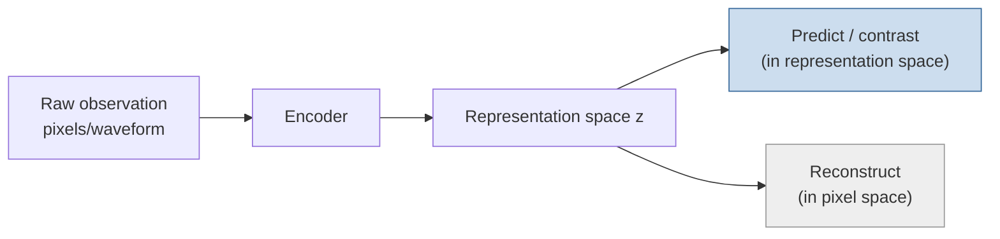

<ModuleProgress id="a04" label="Representation Learning" />

## Why this matters

A world model's ceiling is set by representation quality: predicting the future in pixel space is extremely hard; in a good representation space a linear model may suffice. Representation learning is the world model's "data engine" — and the focal point of the LeCun vs generative-route debate.

## Visual Intuition

The fork between two learning routes: the generative route (lower right) requires the representation to **reconstruct pixels**; the predictive route (upper right, contrastive learning/JEPA) only requires the representation to **predict the representation of another view** — the latter can actively discard pixel detail.

## Core Idea

What makes a representation "good"? For world models, the criterion is **predictive sufficiency**: the representation should retain the information needed to predict the future and compute rewards, while discarding irrelevant detail (lighting, texture noise). Too small a representation loses information; too large a one makes dynamics learning hard — this is the information-bottleneck trade-off.

**Self-supervised learning (SSL)** offers three families of label-free objectives: contrastive learning (InfoNCE — pull together different views of the same content, push apart different content), masked reconstruction (MAE — reconstruct occluded pixels), and **joint-embedding prediction (JEPA)** — predicting the representation of another view in abstract representation space, abandoning pixel-level reconstruction entirely.

The argument for the JEPA route (championed by LeCun): pixels contain vast detail irrelevant to decisions, and forcing a model to reconstruct pixels wastes capacity; V-JEPA / V-JEPA 2 show that video representations can acquire physical intuition from "predicting the representations of masked regions" alone. The generative camp's rebuttal: reconstruction guarantees interpretability and visualization, and the quality of video generation is itself evidence of understanding. This debate runs through Module 10 and Track B Module 12.

## Key Concepts

- **Contrastive learning and InfoNCE**: "like attracts like, unlike repels unlike" in representation space.
- **Collapse**: the trivial solution where every input maps to the same representation — SSL training's number-one enemy.
- **Masked modeling**: MAE-style reconstruction vs JEPA-style prediction in representation space.
- **Linear probe**: freezing the representation and training a linear classifier — the classic protocol for evaluating representation quality.
- **Predictive sufficiency**: the design criterion that a representation retain the information needed for downstream prediction/control.

## Core Equations

The InfoNCE loss:

$$\mathcal{L} = -\log \frac{\exp(\mathrm{sim}(z_i, z_i^+)/\tau)}{\sum_j \exp(\mathrm{sim}(z_i, z_j)/\tau)}$$

## University Lecture

| Course | Lecture | Link |
|---|---|---|
| UPenn CIS 6280 World Models | L05–L06 Self-supervised Representation Learning I/II (contrastive learning, JEPA, masked latent prediction) | [L05 slides](https://jiataogu.me/cis6280-world-models/lectures/lecture-05-representation-learning-i.pdf) |
| Stanford CS231A | L10 Representations & Representation Learning (including the DINO series) | [course homepage](https://web.stanford.edu/class/cs231a/) |

## Papers

- **Must Read**: Assran et al. (2023), *Self-Supervised Learning from Images with a Joint-Embedding Predictive Architecture* (I-JEPA, [arXiv:2301.08243](https://arxiv.org/abs/2301.08243)).
- **Recommended**: He et al. (2022), *Masked Autoencoders Are Scalable Vision Learners* (MAE, [arXiv:2111.06377](https://arxiv.org/abs/2111.06377)); Chen et al. (2020), *A Simple Framework for Contrastive Learning of Visual Representations* (SimCLR, [arXiv:2002.05709](https://arxiv.org/abs/2002.05709)).
- **Optional**: Bardes et al. (2024), *Revisiting Feature Prediction for Learning Visual Representations from Video* (V-JEPA, [arXiv:2404.08471](https://arxiv.org/abs/2404.08471)) — JEPA's extension from images to video, leading straight to Track B Module 12.

## Hands-on

<ColabBadge lab="lab02_latent_dynamics" />

Lab 2's encoder is a representation learner: try replacing its reconstruction loss with a simple contrastive objective and observe how the latent-space structure changes (t-SNE visualization).

## Check Your Understanding

1. Why might "reconstructing pixels" harm a representation used for control?
2. What does "collapse" mean in contrastive learning, and how is it prevented?
3. What is the essential difference between JEPA's and MAE's masked prediction?

Show answer

1. Pixels carry vast amounts of decision-irrelevant information (shadows, textures, background clutter). Training for reconstruction forces the representation to spend capacity on these details, squeezing out genuinely predictive information; a control task only needs a representation that is "sufficient for prediction and reward computation."
2. Collapse means the encoder maps every input to the same vector — InfoNCE is identically 0 but the representation carries no information. Remedies: negative pairs (SimCLR), stop-gradient with a momentum encoder (BYOL/DINO), variance regularization (VICReg), etc.
3. MAE reconstructs masked regions in **pixel space**; JEPA predicts the representations of masked regions in **representation space**. The latter discards pixel detail by design and is closer to the world-model paradigm of "predicting in latent space."

## Takeaway

- Representation quality sets the world model's ceiling; the criterion is predictive sufficiency, not reconstruction fidelity.
- SSL's three objective families — contrastive, masked reconstruction, representation-space prediction (JEPA) — differ in how much information they discard.
- The reconstruction-vs-prediction debate is the field's most important divergence of routes; you will meet it twice more.

## Next Module

[Module 05: Latent Dynamics](./05-latent-dynamics.mdx) — with a representation in hand, make it move.
