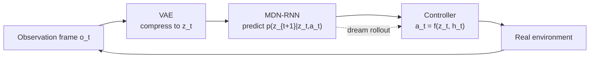

<ModuleProgress id="a07" label="World Models 2018" />

## Why this matters

This course takes its name from this 2018 paper. With a minimalist three-stage architecture it proved that "an agent can train inside its own learned dream," and it exposed the typical failure modes of simple world models — understanding its limits is understanding the motivation for every later improvement.

## Visual Intuition

The three components are **trained independently**: the VAE does the seeing (compressing observations), the MDN-RNN does the dreaming (predicting latent evolution), and the Controller — only a few hundred parameters — decides on $(z_t, h_t)$. Dream training means using M as the environment.

## Core Idea

Ha & Schmidhuber's *World Models* (2018) splits the agent into three independent modules: **Vision (VAE) → Memory (MDN-RNN) → Controller (linear / CMA-ES)**. The key innovation is the **MDN (Mixture Density Network)**: the RNN outputs the parameters of a mixture of Gaussians rather than a single-point prediction, letting the model express stochastic futures — the embryo of RSSM's stochastic state.

The most famous experiment is **dream training** on CarRacing: a policy trained entirely on imagined trajectories generated by the MDN-RNN, deployed zero-shot back into the real environment, still completes the track. This directly demonstrates Module 01's central claim: a world model can trade real trial-and-error for imagined trial-and-error.

The paper is equally honest about failure modes: in the VizDoom experiment, the policy learned to **exploit loopholes in the dream** (in the dream, monsters never shoot fireballs) — the first famous demonstration of model exploitation, and the subject of Module 12. The paper's intellectual lineage traces back to Schmidhuber's 1990s work on "curious model-building control systems."

## Key Concepts

- **VAE (Vision)**: compresses $64\times64\times3$ pixels into a 32-dimensional $z_t$.
- **MDN-RNN (Memory)**: outputs mixture-of-Gaussians parameters, predicting the stochastic next latent state and termination probability.
- **Controller**: a small-parameter policy reading $(z_t, h_t)$ directly, evolved with CMA-ES.
- **Dream training**: training the policy on in-model rollouts with zero real interaction.
- **Model exploitation**: the policy games the model's flaws — invincible in the dream, crashing in reality.

## Core Equations

The MDN-RNN outputs a mixture of Gaussians:

$$p(z_{t+1} \mid z_t, a_t, h_t) = \sum_{k=1}^{K} \pi_k\, \mathcal{N}(z_{t+1} \mid \mu_k, \sigma_k^2)$$

## University Lecture

| Course | Lecture | Link |
|---|---|---|
| UPenn CIS 6280 World Models | L01–L02 (historical context) and L08 Latent World Models | [L08 slides](https://jiataogu.me/cis6280-world-models/lectures/lecture-08-latent-world-models.pdf) |

## Papers

- **Must Read**: Ha & Schmidhuber (2018), *World Models* ([arXiv:1803.10122](https://arxiv.org/abs/1803.10122)) — the full paper is this module, with a companion [interactive blog](https://worldmodels.github.io/).
- **Recommended**: Schmidhuber (1991), *Curious Model-Building Control Systems* (search the title) — the intellectual source; see the coupling of models and curiosity.
- **Optional**: Oh et al. (2015), *Action-Conditional Video Prediction using Deep Networks in Atari Games* (NeurIPS; search the title) — a parallel work on action-conditioned prediction from the same era.

## Hands-on

Lab 3: the tiny RSSM implementation keeps World Models' "stage-wise training" option — you can train each component separately first, then jointly, and compare against end-to-end ELBO training.

**Open Lab**: <ColabBadge lab="lab03_tiny_rssm" />

## Check Your Understanding

1. Why train the three components separately rather than end-to-end?
2. How is the MDN's mixture of Gaussians better than single-point MSE prediction?
3. What fundamental risk of model-based decision-making does "the policy exploiting dream loopholes" expose?

Show answer

1. The engineering reality of 2018: end-to-end training of all three components was computationally expensive and unstable; divide-and-conquer made each step simple on its own (unsupervised VAE, supervised RNN, gradient-free CMA-ES) and fits the "replaceable modules" interface philosophy. The cost is inconsistent component objectives — the Dreamer family's end-to-end ELBO is exactly the response to this.
2. Single-point MSE prediction outputs the "average" of stochastic futures (blurry, unrealistic); a mixture of Gaussians can express multimodal distributions (the car might turn left or right), so sampled dreams resemble real trajectories — otherwise the policy learns wrong dynamics from a blurry dream.
3. Decision-time optimization actively pushes rollouts toward the regions of largest model error (an optimizer naturally seeks the model's loopholes) — model exploitation / model bias. Remedies include short horizons, uncertainty penalties, and closed-loop correction with real data — expanded in Modules 09 and 12.

## Takeaway

- World Models 2018 first demonstrated "dream training" end-to-end with VAE + MDN-RNN + Controller.
- Stage-wise independent training is simple but misaligned in objectives; end-to-end joint training (PlaNet/Dreamer) is the next step.
- The dream-loophole experiment foreshadows model bias — the eternal theme of using models for decisions.

## Next Module

[Module 08: Dreamer](./08-dreamer.mdx) — the benchmark system uniting RSSM, imagination, and actor-critic.
