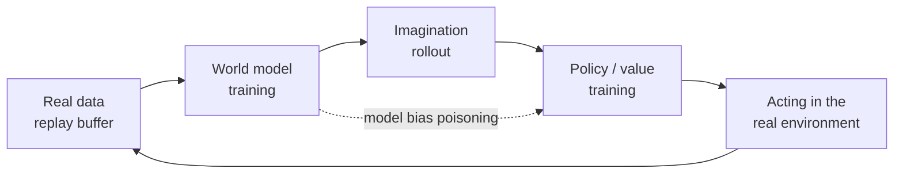

<ModuleProgress id="a11" label="World Model + Policy" />

## Why this matters

The previous modules treated the model and the policy separately; this module closes them into a loop: real data trains the model, model imagination trains the policy, and the policy collects new data to retrain the model. Understanding the dynamics of this loop (including when it collapses) is the core of MBRL engineering competence.

## Visual Intuition

The loop carries both a booster and a poison: sample efficiency comes from imagination (the green line), but model error flows through imagination straight into the policy (the red dashed line) — model bias is the loop's number-one failure mode.

## Core Idea

The systems picture of MBRL begins with **Dyna** (Sutton, 1991): real experience is used both to update the value/policy directly and to train a model, which then generates simulated experience to assist learning — "learning, planning, reacting" in one. Modern systems upgraded every part of Dyna: the model became an RSSM, the simulated experience became imagination rollouts, and planning became actor-critic or MPC.

The loop's key engineering question is the **alternation rhythm**: which trains first, model or policy; how often each updates; on which state distributions the model should be evaluated. DayDreamer (2022) showed this loop can run directly on **real physical robots** — quadruped walking and robotic-arm grasping learned within hours of real interaction, with sample efficiency far beyond model-free — at the cost of strict task constraints (automatic resets, safety bounds).

**Model bias** is the loop's structural risk: the policy optimizer actively seeks the directions of largest model error ("gaming the loopholes"), so high returns in imagination fail to materialize in the real world. The remedies form a toolbox: short-horizon rollouts, uncertainty penalties from probabilistic ensembles (PETS), branched rollouts (MBPO), value-function backstops (TD-MPC) — Module 12 will place them in a unified evaluation framework.

## Key Concepts

- **Dyna architecture**: mixed learning from real and simulated experience.
- **Alternating training**: the update rhythm of model ↔ policy and the drift of data distributions.
- **Model bias / exploitation**: the policy gaming the model's flaws (echoing Module 07's dream loopholes).
- **Branched rollout (MBPO)**: short rollouts starting from real states, bounding error compounding.
- **Real-world RL (DayDreamer)**: the loop running directly on physical robots.

## Core Equations

MBPO's branched-rollout value target:

$$\hat{V}(s) = \sum_{k=0}^{K-1} \gamma^k r_\theta(s_k, a_k) + \gamma^K V_\psi(s_K), \qquad s_0 \text{ from the real buffer}$$

## University Lecture

| Course | Lecture | Link |
|---|---|---|
| UPenn CIS 6280 World Models | L10 Policy & Value Learning with World Models (Dreamer, TD-MPC, model bias) | [course homepage](https://jiataogu.me/cis6280-world-models/) |

## Papers

- **Must Read**: Wu et al. (2022), *DayDreamer: World Models for Physical Robot Learning* ([arXiv:2206.14176](https://arxiv.org/abs/2206.14176)).
- **Recommended**: Janner et al. (2019), *When to Trust Your Model: Model-Based Policy Optimization* (MBPO, [arXiv:1906.08253](https://arxiv.org/abs/1906.08253)); Sutton (1991), *Dyna, an Integrated Architecture for Learning, Planning, and Reacting* (classic paper; search the title).
- **Optional**: Hansen et al. (2024), *TD-MPC2* ([arXiv:2310.16828](https://arxiv.org/abs/2310.16828)).

## Hands-on

Lab 9: connect an actor-critic to the world model from Lab 3, complete the full MBRL loop in imagination, and compare sample efficiency against model-free PPO.

**Open Lab**: <ColabBadge lab="lab09_world_model_policy" />

## Check Your Understanding

1. What is the correspondence between Dyna and the modern Dreamer-style loop?
2. Why is model bias amplified during policy training but inconspicuous in pure prediction?
3. Why do branched rollouts mitigate model bias?

Show answer

1. Dyna's "model generates simulated experience to assist Q-learning" corresponds to Dreamer's "RSSM imagination trains an actor-critic"; the difference is that modern systems use deep latent dynamics as the model and differentiable multi-step rollouts as the simulated experience — but the skeleton is identical. Dyna is the 1991 prototype.
2. Pure prediction passively fits the data distribution; policy optimization is an active search: the optimizer systematically pushes rollouts toward regions where the model overestimates return — adversarially exploiting model error. Prediction error is averaged out; bias is amplified by optimization.
3. A short rollout (K steps) starts from a real state, so model error compounds for at most K steps rather than the whole episode; at the horizon's end a value function trained on real data takes over. K is an explicit knob for "model trustworthiness" — the worse the model, the smaller the K, degenerating to model-free.

## Takeaway

- The MBRL loop = the cycle of data ↔ model ↔ imagination ↔ policy, with Dyna as its prototype.
- The price of sample efficiency is model bias: the optimizer adversarially exploits model error.
- Short horizons, ensembles, branched rollouts, and value backstops are the four great remedies — Module 12 pairs them with evaluation.

## Next Module

[Module 12: OOD, Drift and Evaluation](./12-ood-drift-evaluation.mdx) — when does a world model lie, and how do you catch it?
