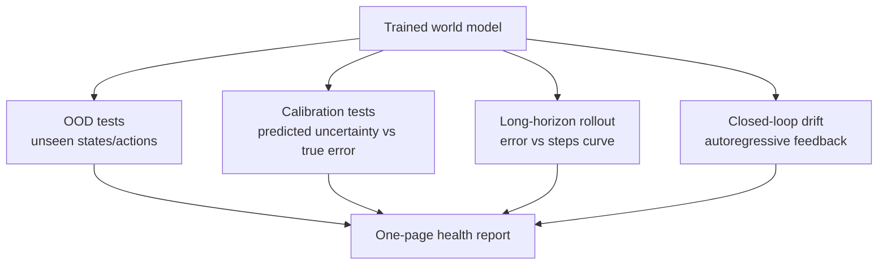

<ModuleProgress id="a12" label="OOD, Drift and Evaluation" />

## Why this matters

When does a world model lie? High scores inside the training distribution cannot hide OOD collapse, error compounding, and closed-loop drift. CIS6280 devotes a standalone lecture to "evaluating world models" — this module gives every model trained in the earlier modules a "health check," and is a required method for the Capstone.

## Visual Intuition

Four families of tests attack four failure modes of the model. The core idea: **one-step accuracy is only the entry ticket**; deployment reliability must be measured separately along these four dimensions.

## Core Idea

**OOD (out-of-distribution)**: is the world model still accurate on states and actions outside the training distribution? Note that the agent **manufactures OOD itself** — once the policy learns new behaviors, the data distribution it collects drifts away from the distribution the model was trained on; this is self-induced distribution shift in closed-loop systems. Evaluation should distinguish interpolation (in-distribution recombination) from extrapolation (genuinely unseen), and only the latter is the hard metric.

**Uncertainty and calibration**: a good model should "know what it doesn't know." Distinguish aleatoric uncertainty (inherent environmental randomness; cannot be eliminated) from epistemic uncertainty (insufficient model knowledge; eliminable by data); ensembles and Bayesian approximations (e.g., MC dropout) are common estimators; calibration curves (predicted confidence vs actual error) test whether the uncertainty "tells the truth" — the Kalman filter provides calibrated uncertainty for free; learned models must work specifically for it.

**Error compounding and drift**: a one-step error $\epsilon$ compounds in the worst case on the order of $O(\epsilon \cdot \frac{\gamma^H - 1}{1-\gamma})$ over a rollout (the discounted-horizon view). The **closed-loop drift** of video world models is its generative version: artifacts amplify frame by frame. Multi-step training objectives, scheduled sampling, and anchoring/resynchronization are the main mitigations. Finally, the **evaluation protocol** should turn utility (downstream task gains), controllability, calibration, OOD, drift, latency, and failure modes into a standard health-check table — exactly the framework of CIS6280 L23, and the deliverable of this course's Lab 10.

## Key Concepts

- **Covariate shift vs semantic shift**: two intensities of distribution shift.
- **Aleatoric vs epistemic**: uncertainty that cannot be eliminated vs uncertainty that learning can eliminate.
- **Calibration**: statistical agreement between confidence and true error.
- **Rollout error bounds**: the chasm between one-step accuracy and long-horizon reliability.
- **The full evaluation table**: utility / controllability / calibration / OOD / drift / latency / failure mode.

## Core Equations

The discounted error-compounding bound (schematic):

$$\big|V^{\pi}_{\text{model}} - V^{\pi}_{\text{real}}\big| \lesssim \frac{\gamma\, \epsilon}{(1-\gamma)^2}, \qquad \epsilon = \max_{s,a}\, D\big(p_\theta(\cdot\mid s,a),\, p_{\text{real}}(\cdot\mid s,a)\big)$$

## University Lecture

| Course | Lecture | Link |
|---|---|---|
| UPenn CIS 6280 World Models | L23 Evaluating World Models (utility, controllability, calibration, OOD, intervention, drift, latency, failure mode) | [course homepage](https://jiataogu.me/cis6280-world-models/) (L23 slides released with the semester) |

## Papers

- **Must Read**: Janner et al. (2019), *When to Trust Your Model: Model-Based Policy Optimization* (MBPO, [arXiv:1906.08253](https://arxiv.org/abs/1906.08253)) — the formalization of model bias and the theoretical analysis of branched rollouts.
- **Recommended**: Hendrycks & Gimpel (2017), *A Baseline for Detecting Misclassified and Out-of-Distribution Examples* ([arXiv:1610.02136](https://arxiv.org/abs/1610.02136)); Kendall & Gal (2017), *What Uncertainties Do We Need in Bayesian Deep Learning for Computer Vision?* ([arXiv:1703.04977](https://arxiv.org/abs/1703.04977)).
- **Optional**: Gal & Ghahramani (2016), *Dropout as a Bayesian Approximation* ([arXiv:1506.02142](https://arxiv.org/abs/1506.02142)).

## Hands-on

Lab 10: run a standardized health check on the world model you trained — calibration curves, rollout error curves, OOD AUROC, drift timelines — and output a one-page report.

**Open Lab**: <ColabBadge lab="lab10_ood_drift_evaluation" />

## Check Your Understanding

1. Why is OOD "self-induced" in closed-loop systems?
2. How do aleatoric and epistemic uncertainty differ in their guidance for planning?
3. Why can't generation-quality metrics (e.g., FVD) substitute for decision-utility evaluation?

Show answer

1. After a policy update, the behavior distribution changes, and newly collected data departs from the model's training distribution; the model is inaccurate on the new distribution, which in turn leads a model-based policy further astray — the closed loop turns static OOD into a dynamic drift problem, requiring continual retraining or active exploration coverage.
2. Regions of high epistemic uncertainty should guide **exploration** (collect data to eliminate ignorance) or **avoidance** in planning (distrust the model); in regions of high aleatoric uncertainty the model will never be accurate, and only short horizons and robust objectives (e.g., risk-sensitive planning) can cope. Confusing the two leads to misguided exploration or excessive conservatism.
3. FVD measures the visual similarity between the generated and real distributions — an open-loop, passive metric. Decision utility cares about prediction accuracy and uncertainty honesty on the state-action pairs a planner will actually visit. A model with beautiful frames but wrong physics can score well on FVD and is guaranteed to fail at planning.

## Takeaway

- Four dimensions of reliability: OOD, calibration, rollout error, closed-loop drift — each with dedicated metrics.
- The value of uncertainty is "knowing what you don't know" — what Kalman gives for free, learned models must earn.
- The evaluation protocol is itself a research object: this course's Lab 10 health-check table will be open-sourced as an eval suite.

## Next Module

[Module 13: Capstone — Build Your Own World Model](./13-capstone.mdx) — turn the knowledge of 12 modules into a system of your own.
