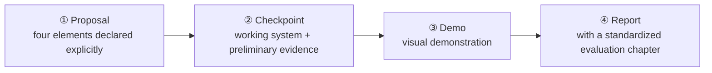

<ModuleProgress id="a13" label="Capstone: Build Your Own World Model" />

## Why this matters

Reading papers and doing labs both follow interfaces defined by others. The real skill of research lies in **defining the interface yourself**: what is your system's state, what does the transition learn, how does the action enter, and by what criteria do you say "it works." The Capstone is that full rehearsal.

## Visual Intuition

The four milestones inherit the design of the CIS6280 final project: proposal → checkpoint → presentation → report. Every milestone is deliverable and reviewable.

## Core Idea

The Capstone's only hard constraint (following CIS6280's official wording): **explore a world-modeling approach in an application domain, explicitly stating the modeled state, transition, action interface, and evaluation criteria**. A vague "I trained a video-prediction model" does not qualify; "the state is a 128-dimensional RSSM latent, the transition is an action-conditioned GRU with a Gaussian head, the action is a 6-dimensional continuous torque, and evaluation uses Module 12's four-dimensional health check" does.

Four suggested topic directions (following CIS6280's classification):

1. **Physical systems**: learned modeling of classical physics / fluids / robotics simulation (e.g., learning particle dynamics in the spirit of GNS);
2. **Video & spatial worlds**: video prediction, 4D scenes, interactive worlds (e.g., a small-scale action-conditioned video model);
3. **Robot learning**: world models in navigation/manipulation tasks (intersecting the Track B Capstone);
4. **Language & digital agents**: world models of text/GUI/tool environments (e.g., a tool-consequence model for a code sandbox).

Compute-budget guidance: every direction offers a tier completable on a free Colab T4 — shrink the resolution / state dimension / data volume, and spend your effort on **interface definition and evaluation rigor**, because that is what is graded.

## Key Concepts

- **Four-element declaration**: state / transition / action interface / evaluation criteria.
- **Milestone system**: proposal → checkpoint → demo → report, each step deliverable.
- **Risk analysis**: the checkpoint must list the biggest technical risks and fallback plans.
- **Standardized evaluation**: the report must contain Module 12's evaluation chapter.
- **Compute tiers**: design a minimal viable version for a free Colab GPU.

## Core Equations

This module is primarily about system design — your four-element declaration should include the explicit form of the transition, e.g., the concrete parameterization and training objective of $p_\theta(s_{t+1} \mid s_t, a_t)$.

## University Lecture

| Course | Project requirements | Link |
|---|---|---|
| UPenn CIS 6280 World Models | Final Project: explicit four-element declaration + four milestones | [course homepage](https://jiataogu.me/cis6280-world-models/) |

## Papers

Depends on your topic (list 3–5 papers directly related to your Capstone in the proposal):

- **Direction references**: DreamerV3 ([arXiv:2301.04104](https://arxiv.org/abs/2301.04104)) for directions 1/3; Genie ([arXiv:2402.15391](https://arxiv.org/abs/2402.15391)) for direction 2; DayDreamer ([arXiv:2206.14176](https://arxiv.org/abs/2206.14176)) for direction 3.

## Hands-on

This module is itself the final Hands-on. Prerequisites: at least two of Labs 1–4, plus the evaluation methodology of Lab 10 (in development).

## Check Your Understanding

1. Why is "explicitly defining the action interface" more important than "choosing a model architecture"?
2. Why does the checkpoint milestone require a risk analysis?
3. How does an evaluation chapter differ from a toy demo that "looks like it works"?

Show answer

1. Architecture is an implementation detail; the interface is a scientific statement: how the action enters the transition determines whether your model can be reused by planners, policies, or other researchers. With the wrong interface, the best architecture cannot plug into any decision loop; with a clear interface, swapping architectures is just engineering iteration.
2. The biggest waste in a research project is discovering at report time that a core assumption fails. The checkpoint forces you — with a working system and preliminary evidence already in hand — to take stock of the biggest risks (e.g., "long rollouts diverge," "not enough data") and give fallbacks (shrink the horizon, switch datasets), moving failure forward to a stage where it can still be fixed.
3. A demo is an existence proof (there exists one trajectory that works); an evaluation is a statistical claim (on a defined test distribution, what are the mean and variance of the metrics, and what are the failure modes). The former can ride on luck; the latter requires a protocol — exactly why Module 12 exists.

## Takeaway

- The core of the Capstone is not how strong the model is, but how clearly the four elements are defined and how rigorous the evaluation is.
- The milestone system front-loads research risk: the proposal fixes the interface, the checkpoint tests feasibility, the demo and report collect evidence.
- Completing this module gives you world-model research training equivalent to the CIS6280 final project.

## Next Module

Track A is complete. To see how world models ground out in the 3D physical world, continue to [Track B Module 01: What is Spatial Intelligence?](../spatial/01-what-is-spatial-intelligence.mdx); or return to [Start Here](../start-here/index.mdx) to revisit the global map.
