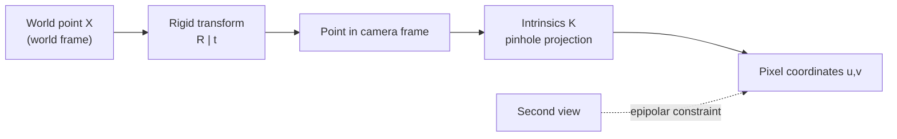

<ModuleProgress id="b02" label="Camera and Geometry" />

## Why this matters

The camera is the most basic "world → observation" model (recall the observation equation from Track A Module 02). Without understanding projection and multi-view constraints, everything later — depth, NeRF, SLAM — is just a pile of APIs. Geometry is the native language of spatial intelligence.

## Visual Intuition

A world point is first transformed by the extrinsics $[R|t]$ into the camera frame, then projected to a pixel by the intrinsics $K$. Two views of the same 3D point induce the epipolar constraint — the source of multi-view supervision without annotations.

## Core Idea

The **pinhole camera model** projects a 3D point to a 2D pixel: the intrinsic matrix $K$ encodes focal length and principal point, and the extrinsics $[R|t]$ encode the camera's pose in the world. Real lenses add distortion parameters; calibration is the process of solving for these parameters from known patterns such as checkerboards — Zhang's method is the industrial standard.

**Epipolar geometry** captures the intrinsic constraint between two views: the images $x, x'$ of the same 3D point satisfy $x'^\top F x = 0$. The fundamental matrix $F$ (intrinsics unknown) / essential matrix $E$ (intrinsics known) depends only on the relative pose of the two cameras, not on the scene — which means camera motion can be recovered from point correspondences (the eight-point algorithm, Nistér's five-point algorithm + RANSAC), and 3D structure can then be triangulated. This is the skeleton of SfM (Structure from Motion), and the shared classical core from COLMAP to SLAM front ends.

Another layer of geometric discipline is **coordinate-frame management**: once the transform chain among world, camera, and body frames gets tangled, every downstream result is wrong. MIT VNAV treats rotation with the rigorous language of the Lie groups $SO(3)/SE(3)$ — rotation matrices are singularity-free but constrained, quaternions are singularity-free and well suited to optimization; this is the common-sense starting point for engineering implementation.

## Key Concepts

- **Intrinsics $K$ / extrinsics $[R|t]$**: the camera's own optical parameters and its pose in the world.
- **Calibration**: solving for intrinsics from known patterns (Zhang's method).
- **Epipolar constraint**: $x'^\top F x = 0$, the geometric bond between two views.
- **Triangulation**: recovering 3D points from intersecting multi-view rays.
- **Rotation representations**: rotation matrices / quaternions / Lie groups, each with its own trade-off between singularities and constraints.

## Core Equations

Pinhole projection:

$$s \begin{bmatrix} u \\ v \\ 1 \end{bmatrix} = K [R \mid t] \begin{bmatrix} X \\ Y \\ Z \\ 1 \end{bmatrix}, \qquad K = \begin{bmatrix} f_x & 0 & c_x \\ 0 & f_y & c_y \\ 0 & 0 & 1 \end{bmatrix}$$

## University Lecture

| Course | Lecture | Link |
|---|---|---|
| Stanford CS231A | L02–L05 (Camera Models, Calibration, multi-view geometry) + PS1/PS2 | [Course page](https://web.stanford.edu/class/cs231a/) |
| ETH/UZH VAMR | L02–L03 (perspective projection, DLT, PnP) and Ex01–Ex02 | [Course page](https://rpg.ifi.uzh.ch/teaching.html) |

## Papers

- **Must Read**: Hartley & Zisserman, *Multiple View Geometry in Computer Vision* (2004, textbook; search the title) — Chapters 6 and 9 are the full version of this module.
- **Recommended**: Zhang (2000), *A Flexible New Technique for Camera Calibration* (IEEE TPAMI; search the title); Nistér (2004), *An Efficient Solution to the Five-Point Relative Pose Problem* (search the title).

## Hands-on

<ColabBadge lab="lab00_tiny_world" />

Lab 0's custom environment is a warm-up for understanding the "observation interface." To build geometric intuition, work through VAMR's public exercises (hand-written implementations of perspective projection and DLT).

## Check Your Understanding

1. With unknown intrinsics, is the two-view constraint expressed with $F$ or $E$, and why?
2. Why can't absolute scale be recovered from a single image?
3. What problem does RANSAC solve in the eight-point pipeline?

Show answer

1. Use the fundamental matrix $F$. The essential matrix $E = K'^\top F K$ depends on the intrinsics; when intrinsics are unknown, only $F$ can be estimated (at the pixel-coordinate level). Once intrinsics are known, coordinates can be normalized to estimate $E$ and decompose it into $R, t$.
2. Pinhole projection folds depth into the scale factor $s$: scaling a 3D point by λ and its distance by λ leaves the projected pixel unchanged. A single view carries only relative geometry; absolute scale requires extra information (a known object size, a stereo baseline, an IMU).
3. Point correspondences contain many outliers, and the eight-point algorithm is noise-sensitive. RANSAC repeatedly samples minimal subsets to propose hypotheses, counts inliers, and keeps the largest consensus set — rescuing the estimate from dirty data.

## Takeaway

- The camera model $K[R|t]$ is the "world → image" observation equation; calibration is system identification.
- Epipolar geometry provides annotation-free multi-view constraints — the geometric foundation of SfM/SLAM.
- Coordinate-frame discipline and the choice of rotation representation are the first lessons of engineering practice.

## Next Module

[Module 03: Depth and Point Clouds](./03-depth-and-point-clouds.mdx) — from 2D pixels to the first explicit 3D representations.
