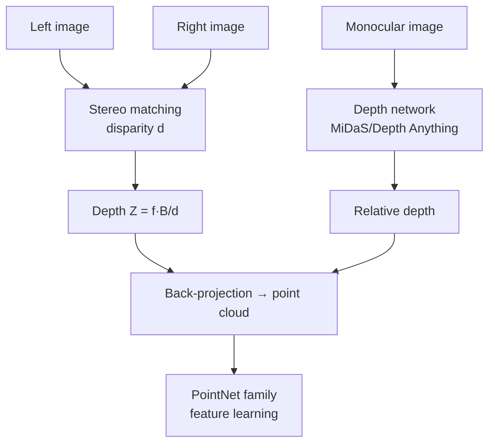

<ModuleProgress id="b03" label="Depth and Point Clouds" />

## Why this matters

Depth is the first bridge from 2D images to the 3D world: with per-pixel depth, an image can be back-projected into a point cloud, and the point cloud is the most versatile explicit 3D representation. Autonomous driving, robotic grasping, and AR are all built on this pipeline.

## Visual Intuition

The two depth routes converge at the point cloud: stereo geometry yields **metric depth** (with absolute scale), while monocular networks yield **relative depth** (strong zero-shot generalization but indeterminate scale).

## Core Idea

**Stereo matching** exploits binocular disparity: the horizontal displacement $d$ of the same 3D point between the left and right images is inversely proportional to depth, $Z = fB/d$. Classical methods use block matching plus regularization; modern methods use a cost volume with 3D convolutions or Transformers. Disparity-estimation accuracy degrades with the square of distance — an intrinsic physical limit of depth sensors.

**Monocular depth** is an ill-posed problem (infinitely many 3D scenes produce the same image), so it relies entirely on learned priors: from the pioneering work of Eigen et al. 2014, to MiDaS's mixed-dataset zero-shot transfer, to Depth Anything's foundation-model approach. In practice we distinguish relative depth (correct ordering, arbitrary scale) from metric depth (which requires calibration or multi-view constraints).

The **point cloud** is the natural representation after back-projecting depth: unordered, irregular, permutation-invariant. **PointNet** (2017) was the first to learn directly on unordered point sets using per-point MLPs plus a symmetric function (max pooling); PointNet++ added hierarchical local structure, establishing the paradigm for point-cloud learning. Beyond point clouds, representations such as occupancy and SDF (the precursors of the neural fields in Module 04) each trade off resolution against memory.

## Key Concepts

- **Disparity–depth relation**: $Z = fB/d$; accuracy degrades quadratically with distance.
- **Scale ambiguity of monocular depth**: relative vs. metric depth.
- **Photometric-consistency self-supervision**: replacing depth annotations with multi-view reconstruction error.
- **Permutation invariance**: the core structural constraint of point-cloud learning.
- **Occupancy / SDF**: continuous implicit occupancy and signed-distance-field representations.

## Core Equations

Stereo depth:

$$Z = \frac{f \cdot B}{d}$$

## University Lecture

| Course | Lecture | Link |
|---|---|---|
| CMU 16-825 Learning for 3D Vision | L04 Single-view 3D: Depth; L18 Point Clouds (PointNet/Point Transformer) | [Course page](https://learning3d.github.io/) |
| Stanford CS231A | L06 Stereo, L11–L12 Monocular Depth + PS3 | [Course page](https://web.stanford.edu/class/cs231a/) |

## Papers

- **Must Read**: Qi et al. (2017), *PointNet: Deep Learning on Point Sets for 3D Classification and Segmentation* ([arXiv:1612.00593](https://arxiv.org/abs/1612.00593)).
- **Recommended**: Ranftl et al. (2020), *Towards Robust Monocular Depth Estimation* (MiDaS, [arXiv:1907.01341](https://arxiv.org/abs/1907.01341)); Godard et al. (2017), *Unsupervised Monocular Depth Estimation with Left-Right Consistency* ([arXiv:1609.03677](https://arxiv.org/abs/1609.03677)).
- **Optional**: Yang et al. (2024), *Depth Anything* ([arXiv:2401.10891](https://arxiv.org/abs/2401.10891)); Qi et al. (2017), *PointNet++* ([arXiv:1706.02413](https://arxiv.org/abs/1706.02413)).

## Hands-on

This module feeds into the data-preparation stage of Lab 5: solving for poses and a sparse point cloud from multi-view images with COLMAP — run it once yourself and you will understand the whole pipeline.

**Open Lab**: <ColabBadge lab="lab05_nerf_gaussian_splatting" />

## Check Your Understanding

1. Why is stereo depth unreliable at long range?
2. Where does the "scale ambiguity" of monocular depth networks come from?
3. Why does PointNet aggregate point features with max pooling?

Show answer

1. Differentiate $Z = fB/d$: $\Delta Z \approx \frac{Z^2}{fB}\Delta d$ — depth error grows with the square of distance, while disparity resolution is limited by pixels. Physically, once the baseline $B$ is fixed, stereo degenerates to monocular at long range.
2. A single image loses absolute scale: scaling the scene and the camera distance by the same factor leaves the image unchanged. Training data can only supervise relative structure, so the network learns "depth ordering + scene priors"; absolute scale must be anchored by extra information (sensors, known object sizes).
3. A point cloud is an unordered set, so the network's output must be invariant to the permutation of input points. Max pooling is a symmetric function (order-independent) that also extracts globally salient features — PointNet's theoretical contribution is precisely proving that symmetric functions can approximate arbitrary set functions.

## Takeaway

- Depth connects 2D and 3D: stereo gives scale, monocular gives generalization, and the point cloud is where the two meet.
- Monocular depth is a learned prior regularizing an ill-posed problem; the relative/metric distinction is basic engineering literacy.
- PointNet's permutation-invariant design is the paradigm-setting starting point of 3D representation learning.

## Next Module

[Module 04: NeRF and Gaussian Splatting](./04-nerf-gaussian-splatting.mdx) — from discrete point clouds to continuous, renderable scene representations.
