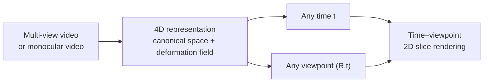

<ModuleProgress id="b05" label="Dynamic 3D / 4D Worlds" />

## Why this matters

The real world moves: people walk, hands grasp, traffic flows. The static representations of Module 04 break down outright in dynamic scenes. 4D representations (3D + time) are the key step for spatial intelligence to go from "reconstructing photographs" to "modeling the world."

## Visual Intuition

Mainstream 4D approaches share one idea: maintain a static representation in a **canonical space**, then learn a **deformation field** that maps the scene at each time step back into the canonical space. Querying = pick a time + pick a viewpoint.

## Core Idea

**DynamicFusion** (2015) is the origin of this line of thought: it reconstructs non-rigid dynamic scenes in real time from a depth camera, continuously "fusing" observed frames into a canonical model while estimating a per-point warp field. It established the "canonical model + deformation + real-time fusion" paradigm; everything that followed is a revival of this paradigm in the era of neural representations.

The **dynamic NeRF** lineage (Nerfies, D-NeRF) adds time or a deformation code to the radiance field's inputs: $F_\theta(x, d, t)$ or $F_\theta(x + \Delta_\psi(x, t), d)$. **4D Gaussian Splatting** (4D-GS) and **Dynamic 3D Gaussians** turn the parameters of Gaussian primitives into functions of time, preserving 3DGS's real-time performance. Wu et al.'s 4D-GS factorizes spacetime features into six planes; Luiten et al.'s Dynamic 3D Gaussians perform tracking with persistent Gaussians — **reconstruction and tracking are unified into a single optimization**.

From the world-model perspective, 4D representations answer the spatial version of "how does the world state evolve over time": scene flow (a per-point 3D motion field) is the microscopic dynamics, dynamic occupancy is the evolution at the occupancy level, and modeling contact and interaction is the bridge to manipulation tasks (Modules 09/12). Under-observation is the fundamental difficulty: occluded parts of dynamic regions in monocular video receive no supervision at all and can only be filled in by priors and smoothness regularization.

## Key Concepts

- **Canonical space + deformation field**: the dominant paradigm of 4D representation.
- **Scene flow**: a per-point 3D motion field — the 3D version of optical flow.
- **Dynamic occupancy**: the temporal evolution of occupancy state.
- **Reconstruction–tracking unification**: persistent Gaussians serve as both representation and tracker.
- **Under-observation**: the supervision vacuum in dynamic + occluded regions, filled by priors.

## Core Equations

The deformation-field paradigm:

$$x_t^{\text{obs}} = x^{\text{canonical}} + \Delta_\psi(x^{\text{canonical}}, t)$$

## University Lecture

| Course | Lecture | Link |
|---|---|---|
| UPenn CIS 6280 World Models | L16 Spatial World Models II / 4D (scene flow, tracking, dynamic occupancy, contact) | [Course page](https://jiataogu.me/cis6280-world-models/) |
| CMU 16-825 | L13 Dynamic 3D Representations (Nerfies, Neural Scene Flow Fields) | [Course page](https://learning3d.github.io/) |

## Papers

- **Must Read**: Park et al. (2021), *Nerfies: Deformable Neural Radiance Fields* ([arXiv:2011.12948](https://arxiv.org/abs/2011.12948)).
- **Recommended**: Newcombe, Fox & Seitz (2015), *DynamicFusion* (CVPR; search the title); Luiten et al. (2024), *Dynamic 3D Gaussians: Tracking by Persistent Dynamic View Synthesis* ([arXiv:2310.08528](https://arxiv.org/abs/2310.08528)).
- **Optional**: Wu et al. (2024), *4D Gaussian Splatting for Real-Time Dynamic Scene Rendering* (search the title, 2024).

## Hands-on

Lab 6: train a 4D representation on the D-NeRF synthetic dataset and produce a "time × viewpoint" 2D rendering grid.

**Open Lab**: <ColabBadge lab="lab06_dynamic_4d_worlds" />

## Check Your Understanding

1. Why is "canonical space + deformation field" better than "independent per-frame reconstruction"?
2. What does the under-observation problem in dynamic scenes refer to?
3. What is the essential difference between a 4D representation and Track A's video world models (Module 10)?

Show answer

1. Independent per-frame reconstruction throws away temporal consistency (the same object gets rebuilt as different geometry across frames) and wastes multi-frame observations — the deformation paradigm lets all time steps share one canonical geometry, aggregates observations across time, and naturally solves flicker and completion under occlusion.
2. Under monocular or sparse views, regions of dynamic objects that are occluded or briefly out of frame have no observational constraint at the corresponding times, and the deformation field is free there — it can only be filled by smoothness priors, as-rigid-as-possible regularization, or learned motion priors. This is the main source of error in 4D reconstruction.
3. Video world models learn a generative model over pixel distributions and guarantee no 3D consistency; 4D representations model geometry explicitly, are constrained by multi-view consistency, and can be queried from any viewpoint — but they usually do not model "evolution conditioned on actions." The two are converging (generative 4D, interactive 3D), which is a frontier seam of the field.

## Takeaway

- The dominant 4D paradigm: canonical space + deformation field, with DynamicFusion as its prototype.
- Reconstruction and tracking are unified in persistent representations; under-observation is filled by priors.
- 4D representations are the temporal dimension of spatial world models, and are converging with the video-generation route.

## Next Module

[Module 06: State Estimation](./06-state-estimation.mdx) — from "what does the world look like" to "where am I."
