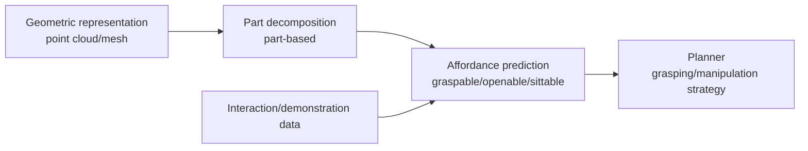

<ModuleProgress id="b09" label="Affordance" />

## Why this matters

A chair is not "a cluster of points" but "something you can sit on." Affordance shifts spatial representation from "what the world is" to "what the world lets me do" — this is the interface between perception and action, and the core that separates robotic intelligence from pure vision.

## Visual Intuition

Two input cues feed affordance: geometric structure (the shape of a cup handle suggests graspability) and functional experience (where people grasp in demonstrations). The output plugs directly into planning — this is an "action-oriented representation."

## Core Idea

The concept of **affordance** originates in Gibson's (1979) ecological psychology: the environment offers the actor possibilities for action — a doorknob "affords" turning, flat ground "affords" walking. The key claim: affordance is a **relation between the environment and the actor**, not a property of the object itself — the same door is a passage for a person and a wall for a tracked robot. This dictates that affordance representations must be indexed by (object/part, action).

The **part-based view** (a signature direction of UCSD's Hao Su group) anchors affordance at the part level: PartNet provides fine-grained hierarchical part annotations, enabling part-level functional reasoning such as "the cabinet door can be pulled open, the drawer can be pulled out." Part mobility (articulation: revolute/prismatic joints and their axes) is the intermediate representation from geometry to function — knowing the hinge axis lets you predict the door's opening trajectory, which is almost a miniature analytic world model.

The data bottleneck of learning affordance is the fundamental challenge: geometry can be recovered from photographs, but function must come from **interaction or demonstration**. Robotics practice includes extracting grasp poses from human videos, actively sampling interactions in simulation, and transferring from semantic priors with VLMs ("cups have handles"). The affordance–planning interface turns it into a decision resource: the planner queries "where can I grasp" rather than "what is a chair."

## Key Concepts

- **Affordance (Gibson)**: possibilities for action between the environment and the actor.
- **Part-level function**: PartNet-style fine-grained annotation — the structured carrier of affordance.
- **Mobility**: the kinematics of parts (hinge/slider axes) — the intermediate layer from geometry to function.
- **Learning from demonstration/interaction**: functional data cannot be obtained free from passive observation.
- **Perception–action interface**: planners consume affordances, not raw geometry.

## Core Equations

This module is intuition-first. Affordance prediction can be formalized as the conditional distribution $p(\text{success} \mid x, a)$ — the probability of success when executing action $a$ at part/pose $x$.

## University Lecture

| Course | Lecture | Link |
|---|---|---|
| UCSD Machine Learning Meets Geometry (WI22) | Part-based 3D Analysis, Mobility, Zero-shot 3D Understanding | [Course page](https://haosulab.github.io/ml-meets-geometry-WI22/) |

## Papers

- **Must Read**: Mo et al. (2019), *PartNet: A Large-Scale Benchmark for Fine-Grained and Hierarchical Part-Level 3D Object Understanding* ([arXiv:1812.02713](https://arxiv.org/abs/1812.02713)).
- **Recommended**: Gibson (1979), *The Ecological Approach to Visual Perception* (classic book; the origin of the affordance concept); Locatello et al. (2020), *Object-Centric Learning with Slot Attention* ([arXiv:2006.15055](https://arxiv.org/abs/2006.15055)) — the neighboring technique of unsupervised object decomposition.
- **Optional**: Florence, Manuelli & Tedrake (2018), *Dense Object Nets* ([arXiv:1806.08756](https://arxiv.org/abs/1806.08756)) — dense correspondence as a representation for manipulation.

## Hands-on

Lab 9's robot closed loop will use affordance-style queries; for now, visualize part annotations on the PartNet dataset to build "part–function" intuition.

**Open Lab**: <ColabBadge lab="lab09_world_model_policy" />

## Check Your Understanding

1. Why is affordance a relation rather than an object property?
2. Why can part mobility (e.g., a hinge axis) be viewed as a miniature world model?
3. How is the data bottleneck of affordance learning fundamentally different from that of geometric reconstruction?

Show answer

1. The same "ground" affords walking for a person but not for a drone; the same door is a passage for a robot narrower than the doorway and an obstacle otherwise. Affordance depends on the actor's body and capability model and must be indexed by (environment element × actor) — exactly the embodied-intelligence instance of "body shape determines perception."
2. Knowing the hinge axis and the door panel's geometry lets you predict "how the door will move when torque is applied" — an analytic, single-part transition model. Manipulation planning for articulated parts (opening doors, pulling drawers) is essentially querying this miniature world model.
3. Geometry has passive supervision (photos, depth, multi-view consistency) that can be obtained free at scale; function/affordance must come from interaction or demonstration — "this handle is graspable" is known only by grasping it (or watching someone grasp it). Data scarcity makes prior transfer (semantics, VLMs) a research hotspot.

## Takeaway

- Affordance is an action-oriented spatial representation: the possibilities for action between environment × actor.
- Part-level decomposition and mobility are the structured intermediate layer from geometry to function.
- Functional data must come from interaction — which ties affordance naturally to active learning and embodied data.

## Next Module

[Module 10: Navigation](./10-navigation.mdx) — assembling maps, memory, and affordance into the first killer application.
