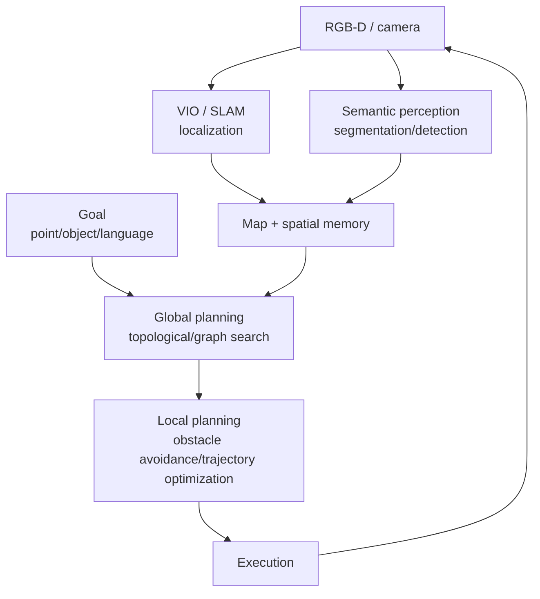

<ModuleProgress id="b10" label="Navigation" />

## Why this matters

Navigation is the first killer application of spatial intelligence: it twists together all previous modules (geometry, state estimation, maps, memory, affordance) into one system. It is also the cleanest testbed for the question "how much do world models actually help decision-making?"

## Visual Intuition

The classical navigation pipeline: localization and mapping (Modules 06–08) feed global planning (topological layer) and local planning (metric layer), and execution produces new observations that close the loop back into perception.

## Core Idea

**Geometric navigation** is the mature paradigm: SLAM/VIO provides localization and the map, a global planner (A*/Dijkstra on a topological graph or occupancy grid) produces the path, and a local planner (trajectory optimization, dynamic window) handles real-time obstacle avoidance. MIT VNAV's entire course is the textbook of this pipeline: from geometric foundations to minimum-snap trajectory optimization to full deployment on a drone platform. The coupling points of the pipeline are this course's focus — localization error poisons the map, map errors mislead planning, and evaluation must be end to end.

**Learning-based navigation** expands the goal from "go to coordinate (x, y)" to semantics and language: PointGoal (go to coordinates), ObjectGoal ("find the refrigerator"), Vision-and-Language Navigation ("walk into the living room and turn left"). CMP (Cognitive Mapping and Planning, 2017) is the origin on the learning side: the network internally maintains a differentiable spatial-memory map and plans on it — exactly the learned version of the "spatial memory + world model" architecture.

The role of world models in navigation is now taking shape: navigation world models (work in the Navigation World Models family) learn to **predict the next observation/occupancy**, letting the agent "imagine" the consequences of a route before executing — bringing Track A's imagination idea into metric space. This connects directly to the robot world models and VLA of Modules 11–12.

## Key Concepts

- **Global planning vs. local obstacle avoidance**: path search at the topological layer vs. real-time trajectories at the metric layer.
- **PointGoal / ObjectGoal / VLN**: three abstraction levels of navigation goals.
- **Cognitive-map-style learning**: differentiable spatial memory + learned planning (the CMP paradigm).
- **Navigation world models**: imagining future observations to aid route decisions.
- **Sim-to-real**: the gap between training in simulation and deploying in reality (developed in Module 11).

## Core Equations

The global-planning objective on an occupancy grid:

$$\min_{\pi} \sum_{t} c(s_t, a_t), \qquad \text{s.t. } s_{t+1} = f(s_t, a_t),\; s_t \notin \mathcal{O}_{\text{occupied}}$$

## University Lecture

| Course | Lecture | Link |
|---|---|---|
| MIT 16.485 VNAV | The whole course is visual navigation (VO/VIO + trajectory optimization L08–L10 + drone platform) | [Course page](https://vnav.mit.edu/) |

## Papers

- **Must Read**: Gupta et al. (2017), *Cognitive Mapping and Planning for Visual Navigation* (CMP, [arXiv:1702.03920](https://arxiv.org/abs/1702.03920)).
- **Recommended**: Anderson et al. (2018), *Vision-and-Language Navigation* (VLN, [arXiv:1711.07280](https://arxiv.org/abs/1711.07280)).
- **Optional**: Bar et al. (2024), *Navigation World Models* (search the title, 2024) — video-prediction-style navigation world models.

## Hands-on

Lab 8: build a "predict the next observation/occupancy + assist planning" pipeline in a lightweight navigation simulator, and evaluate a state-estimation baseline on EuRoC sequences.

**Open Lab**: <ColabBadge lab="lab08_navigation_world_model" />

## Check Your Understanding

1. Why is global planning usually done at the topological layer rather than the metric layer?
2. What is the fundamental difference between CMP and the classical SLAM + planning pipeline?
3. In navigation, what is the advantage of "imagining future observations" over "directly outputting actions"?

Show answer

1. Search complexity on a metric grid explodes with map size, and long-range planning does not need centimeter-level precision; a topological graph compresses space into place nodes and edges, so search is a graph algorithm (efficient, scalable), with the details handed to the local planner. Hierarchies are the general solution for complex systems.
2. The classical pipeline is a chain of hand-crafted modules (estimation → mapping → planning), each trained/designed independently, with errors propagating stage by stage; CMP makes the map and the planner differentiable internal structures of a network, learned end to end from the task objective — what memory stores and how planning uses it are both shaped backward by the task.
3. Imagining observations (the world-model route) grounds decisions in interpretable predictions: the consequences of multiple candidate routes can be evaluated before choosing; directly outputting actions (reactive policies) is a black-box mapping whose failures out of distribution are undiagnosable. The former also lets one model serve many goals — decoupling the model from the task.

## Takeaway

- Navigation = the closed loop of localization + map + hierarchical planning — the system integration of all previous modules.
- Learning-based goals move from coordinates to semantics and language, and spatial memory becomes a differentiable internal structure.
- Navigation world models bring imagination into metric space — the bridge to robot world models.

## Next Module

[Module 11: Robot World Models](./11-robot-world-models.mdx) — putting the closed loop on a real body.
