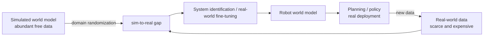

<ModuleProgress id="b11" label="Robot World Models" />

## Why this matters

However beautiful the imagination in simulation, it only counts once mounted on a real robot: sensor noise, contact dynamics, and reset costs are all things simulation lacks. Robot world models are the stress test of Track A's methodology in the physical world.

## Visual Intuition

The core tension of robot world models: simulated data is free but not real; real data is real but expensive. Domain randomization, system identification, and world-model-assisted sample efficiency are the three tools for bridging the gap.

## Core Idea

**Sim-to-real** is the first-order problem of robot learning. A simulator is itself a hand-crafted world model — its model error (the reality gap) concentrates in physically hard regions such as contact, friction, and deformation. The strategy of **domain randomization** (Tobin et al., 2017) is "fighting poison with poison": randomize the simulator's visual and physical parameters so the policy/model sees enough diverse "fake worlds" that the real world becomes just another in-distribution sample. System identification takes the opposite route: use real data to infer simulation parameters and tune the fake world toward truth.

The feasibility of **learning world models on real robots** was first systematically demonstrated by DayDreamer (2022; Track A Module 11 covered its MBRL mechanism): learning quadruped walking and grasping within a few hours of real interaction — the key constraints being automatic resets, safety bounds, and small task design. The bottleneck of real-world learning shifts from algorithms to **systems engineering**: who puts the robot back to its initial state, and how does it shut down safely after a failure?

**DINO-WM** (2024) represents the new paradigm: instead of learning representations from scratch, freeze the features of a pretrained vision foundation model (DINOv2) as the observation space, and learn latent dynamics and planning on top — the pretrained representation fills in the visual side of the sim-to-real gap in advance. This echoes Track A Module 04's claim: representation quality determines the ceiling of a world model, and foundation models outsource representation learning to internet-scale data.

## Key Concepts

- **Reality gap**: where simulator model error concentrates (contact/friction/deformation).
- **Domain randomization**: covering the real world with distribution width.
- **System identification**: calibrating simulation parameters with real data.
- **Real-world RL**: online learning under automatic resets and safety constraints (DayDreamer).
- **Frozen representations + dynamics**: the DINO-WM-style foundation-model grafting route.

## Core Equations

The objective of domain randomization (optimizing expected performance over a distribution $\Xi$ of randomized parameters):

$$\theta^* = \arg\max_\theta\, \mathbb{E}_{\xi \sim \Xi}\big[ J(\theta; \xi) \big]$$

## University Lecture

| Course | Lecture | Link |
|---|---|---|
| UPenn CIS 6280 World Models | L18 Robot Learning I (sim-to-real, domain randomization, system identification; Resources includes DayDreamer and DINO-WM) | [Course page](https://jiataogu.me/cis6280-world-models/) |

## Papers

- **Must Read**: Wu et al. (2022), *DayDreamer: World Models for Physical Robot Learning* ([arXiv:2206.14176](https://arxiv.org/abs/2206.14176)).
- **Recommended**: Tobin et al. (2017), *Domain Randomization for Transferring Deep Neural Networks from Simulation to the Real World* ([arXiv:1703.06907](https://arxiv.org/abs/1703.06907)); Zhou et al. (2024), *DINO-WM* (search the title, 2024) — world models and planning on frozen DINOv2 features.
- **Optional**: Todorov, Erez & Tassa (2012), *MuJoCo: A Physics Engine for Model-Based Control* (search the title) — the hand-crafted world model as a reference baseline.

## Hands-on

Lab 9: the engineering version of the MBRL closed loop. Track B learners should focus on the return-gap analysis between imagination and real rollouts — that is a direct measure of the reality gap.

**Open Lab**: <ColabBadge lab="lab09_world_model_policy" />

## Check Your Understanding

1. What strategies do domain randomization and system identification each use to bridge the reality gap?
2. When DayDreamer learns on real robots, what is the biggest engineering constraint?
3. What are the benefits and risks of DINO-WM freezing pretrained representations?

Show answer

1. Randomization "widens the training distribution": train the model on many perturbed fake worlds so the real world hopefully falls inside the distribution — it seeks policy robustness, not simulator accuracy. System identification "calibrates the simulator": infer physical parameters (mass, friction) from real data so the fake world approaches the real one. The former changes the training distribution, the latter changes the model itself; in practice they are often combined.
2. Not the algorithm but resets and safety: online learning inevitably produces many failed trials, requiring automatic reset mechanisms (e.g., homing the arm, safety cages) and hard constraints on collision/torque — otherwise hardware damage or injury risk makes the experiment infeasible. Task design (short episodes, recoverable states) determines feasibility.
3. Benefits: visual understanding is inherited directly from internet-scale data, the visual sim-to-real gap disappears, and dynamics can be learned from little data. Risks: frozen features may discard control-relevant detail (precise depth, contact-force cues), and there is no guarantee that dynamics in the feature space is predictable — a good representation is not necessarily a predictable one (recall the design criteria of Track A Module 05).

## Takeaway

- The core tension of robot world models: simulation is free but not real vs. reality is real but expensive.
- Randomization, system identification, and real-world online learning are the three tools for bridging the reality gap.
- Foundation-model representation grafting (DINO-WM) foreshadows the next paradigm of robot world models.

## Next Module

[Module 12: VLA and World-Action Models](./12-vla-world-action-models.mdx) — where robot policies and world models meet in the era of large models.
