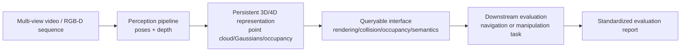

<ModuleProgress id="b13" label="Capstone: Build Your Own Spatial World Model" />

## Why this matters

Every module of Track B has handed you one building block (geometry, representation, estimation, memory, action). The Capstone asks you to assemble them into a complete system **from raw video to a queryable world to action evaluation** — that is the definition of a "spatial intelligence engineer."

## Visual Intuition

The minimal closed loop of the Capstone: video in, representation stored, queries out, tasks evaluated. All four stages must be present; quality trade-offs are yours to make.

## Core Idea

The default form of the Track B Capstone: **build a queryable, persistent 3D/4D scene representation from multi-view video, and evaluate its value on a navigation or manipulation task**. It shares the same constraint as the Track A Capstone — explicitly define the state / transition / action interface / evaluation criteria — but the "state" here is a spatial representation (occupancy grid, Gaussian field, or scene graph — your choice), and the "transition" is the update rule of the scene over time or under interaction.

Three suggested project tiers (in increasing workload):

1. **Static scene + navigation evaluation**: phone video circling a scene → COLMAP poses → 3DGS/occupancy map → demonstrate planning queries given goal points (rendering checks visibility, occupancy checks collisions). The workload concentrates on pipeline integration.
2. **Dynamic scene 4D representation**: monocular dynamic video → 4D Gaussians/deformable NeRF → an "any time + any viewpoint" query interface → quantitative comparison against static reconstruction (PSNR, tracking consistency).
3. **Representation-driven downstream task**: in a simulated navigation/manipulation task, compare the success rate of "planning with your representation" against an "end-to-end policy" — directly answering the research question "is an explicit spatial world model worth it?"

The evaluation requirements are the same as Track A's: the report must contain a standardized evaluation section (ATE/RPE for localization, PSNR/rendering quality for representation, success rate + failure-mode analysis for tasks) — a demo video alone is not acceptable.

## Key Concepts

- **Queryable interface**: a representation's value is defined by the queries it supports (rendering/collision/semantics).
- **Pipeline integration**: end-to-end responsibility from perception → representation → queries → tasks.
- **Quantitative evaluation culture**: ATE/RPE, PSNR, success rate, failure modes.
- **The four-element declaration**: the hard constraint shared with the Track A Capstone.
- **Three project tiers**: static navigation / dynamic 4D / downstream-task comparison.

## Core Equations

This module is primarily about system design — in your report, the state (e.g., an occupancy field $m: \mathbb{R}^3 \to [0,1]$) and the query interface (e.g., a collision query $\mathbb{1}[m(x) > \tau]$) should be written in explicit mathematical form.

## University Lecture

| Course | Reference | Link |
|---|---|---|
| UPenn CIS 6280 World Models | Final Project's four milestones and four-element constraint | [Course page](https://jiataogu.me/cis6280-world-models/) |
| MIT 16.485 VNAV | The quantitative evaluation culture of the EuRoC dataset + evo | [Course page](https://vnav.mit.edu/) |

## Papers

Depends on your topic (list 3–5 directly relevant papers in your proposal):

- **Pointers by direction**: 3DGS ([arXiv:2308.04079](https://arxiv.org/abs/2308.04079)) for direction 1; Dynamic 3D Gaussians ([arXiv:2310.08528](https://arxiv.org/abs/2310.08528)) for direction 2; CMP ([arXiv:1702.03920](https://arxiv.org/abs/1702.03920)) for direction 3.

## Hands-on

This module is the final Hands-on. Prerequisites: complete at least two of Labs 5–8 (in development), plus the evaluation methodology of Lab 10 (in development).

## Check Your Understanding

1. Why does the "queryable interface" define the Capstone's value better than "the representation itself"?
2. What is the biggest trap in designing the comparison experiment of direction 3?
3. Why is failure-mode analysis as important as the success-rate number?

Show answer

1. A Gaussian field that can only "render videos" is merely a reconstruction result; once query interfaces are defined (collision, visibility, semantic retrieval), it becomes a "world state" that planners and world models can consume. The interface turns a representation from a product into a resource — which is exactly how a world model is defined.
2. Unfair comparison: if the explicit-representation route enjoys extra information (ground-truth poses, a longer planning budget), the conclusion is meaningless. Observation inputs, compute budgets, and evaluation protocols must be unified, with confidence intervals reported — otherwise all you have proven is "the method with more information does better."
3. Success rate is the mean; failure modes are the variance and the tail: real deployments die in the long tail (reflective surfaces, dynamic occlusion, thin structures). Failure-mode analysis both exposes the representation's systematic weaknesses (guiding the next iteration) and delimits the system's safe operating domain — the shared mark of maturity in engineering reports and research papers alike.

## Takeaway

- Track B Capstone = the minimal closed loop of video in, representation stored, queries out, tasks evaluated.
- Define the spatial state and query interface explicitly; value is measured by the downstream tasks it supports.
- Quantitative evaluation and failure-mode analysis are the other half of the deliverable — as important as the system itself.

## Next Module

Track B is complete. For the global map, see [Start Here](../start-here/index.mdx); to understand the prediction and planning theory built on top of spatial representations, we recommend [Track A Module 09: Planning with World Models](../scientist/09-planning-with-world-models.mdx).
